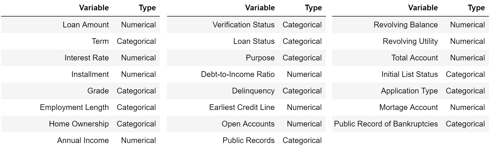
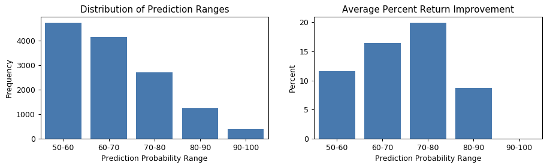

# Overview

Using [loan data from Lending Club](https://www.lendingclub.com/info/download-data.action) we use machine learning to predict the risk of loan defaults. Additionally, using the results from the predictive modeling, we improve the potential return on investment.

## Table of Contents

1. [Introduction](README.md#introduction)
2. [Description of Data](README.md#description-of-Data)
3. [Model Details](README.md#model-details)
4. [Model Results](README.md#model-results)
5. [Return on Investment](README.md#return-on-investment)

## Introduction

Suppose a bank wants to know whether potential loan applicants will default on a loan. Loan information for a client is provided and a binary outcome of fully paid or default is predicted. We will use logistic regression, random forest, neural network, xgboost, and ensemble classifieres to create a model. This will provide useful metrics and help improve return on investment for the company.

## Description of Data

Set of features:

  

Each row represents a client's financial information

<table border="1" class="dataframe">
  <thead>
    <tr style="text-align: right;">
      <th></th>
      <th>loan_amnt</th>
      <th>term</th>
      <th>int_rate</th>
      <th>installment</th>
      <th>grade</th>
      <th>emp_length</th>
      <th>home_ownership</th>
      <th>annual_inc</th>
      <th>verification_status</th>
      <th>loan_status</th>
      <th>purpose</th>
      <th>dti</th>
      <th>delinq_2yrs</th>
      <th>earliest_cr_line</th>
      <th>open_acc</th>
      <th>pub_rec</th>
      <th>revol_bal</th>
      <th>revol_util</th>
      <th>total_acc</th>
      <th>initial_list_status</th>
      <th>total_pymnt</th>
      <th>application_type</th>
      <th>mort_acc</th>
      <th>pub_rec_bankruptcies</th>
    </tr>
  </thead>
  <tbody>
    <tr>
      <th>0</th>
      <td>5000</td>
      <td>36 months</td>
      <td>7.35%</td>
      <td>155.19</td>
      <td>A</td>
      <td>5 years</td>
      <td>MORTGAGE</td>
      <td>60000.0</td>
      <td>Not Verified</td>
      <td>Fully Paid</td>
      <td>car</td>
      <td>15.76</td>
      <td>0</td>
      <td>Oct-04</td>
      <td>12</td>
      <td>0</td>
      <td>3697</td>
      <td>13.20%</td>
      <td>25</td>
      <td>w</td>
      <td>5385.245133</td>
      <td>Individual</td>
      <td>1</td>
      <td>0</td>
    </tr>
  </tbody>
</table>

Details of the implementation can be found [here](https://github.com/ZhuLeon/Loan-Default-Prediction/blob/master/src/README.md).

## Model Details

In progress...

## Model Results

