# Loan Default Risk


```python
from numpy.random import seed
seed(1)
from tensorflow import set_random_seed
set_random_seed(2)
import os
from pathlib import Path
import pandas as pd
import numpy as np
import matplotlib.pyplot as plt
import seaborn as sns
from joblib import dump, load
from sklearn.model_selection import train_test_split
from sklearn.linear_model import LogisticRegression
from sklearn.ensemble import RandomForestClassifier
from sklearn.inspection import permutation_importance
from sklearn.preprocessing import StandardScaler
from sklearn.metrics import confusion_matrix, f1_score, classification_report, accuracy_score, auc, roc_curve, roc_auc_score, precision_recall_curve
from sklearn.utils import class_weight
from imblearn.over_sampling import SMOTE
from imblearn.over_sampling import ADASYN
from keras.models import Sequential
from keras.layers import Dense
from keras.utils import to_categorical
from keras.models import load_model
from xgboost import XGBClassifier
from xgboost import plot_importance
```

    Using TensorFlow backend.
    


```python
def plot_var(col_name, title, continuous, dataset, x1limit=False, x2limit=False, x1l=0, x1u=0, x2l=0, x2u=0):
    """
    Plot a variable against the response variable loan status
    - col_name is the variable name in the dataframe
    - title is the full variable name
    - continuous is True if the variable is continuous, False otherwise
    - dataset is the pandas dataframe containing the dataset
    """
    f, (ax1, ax2) = plt.subplots(nrows=1, ncols=2, figsize=(12, 3), dpi=90)

    # Plot without loan status
    if continuous:
        sns.distplot(dataset.loc[dataset[col_name].notnull(), col_name], kde=False, ax=ax1)
    else:
        sns.countplot(dataset[col_name], order=sorted(dataset[col_name].unique()),
                      color='#4f81bd', saturation=1, ax=ax1)
    if x1limit:
        ax1.set_xlim([x1l, x1u])
    ax1.set_xlabel(title)
    ax1.set_ylabel('Frequency')
    ax1.set_title(title)

    # Plot with loan status
    if continuous:
        sns.boxplot(x=col_name, y='loan_status', data=dataset, ax=ax2)
        ax2.set_ylabel('')
        ax2.set_title(title + ' by Loan Status')
    else:
        charge_off_rates = dataset.groupby(col_name)['loan_status'].value_counts(normalize=True).loc[:, 'Default']
        sns.barplot(x=charge_off_rates.index, y=charge_off_rates.values, color='#4f81bd', saturation=1, ax=ax2)
        ax2.set_ylabel('Fraction of Loans Default')
        ax2.set_title('Default Rate by ' + title)
    if x2limit:
        ax2.set_xlim([x2l, x2u])
    ax2.set_xlabel(title)

    plt.tight_layout()
```

# Preliminary Data Analysis


```python
# read in the entire raw dataset
dataset = pd.read_csv(Path('../data/2017Half_clean.csv'), header=0)
pd.set_option('display.max_columns', None)
dataset.head()
```


<div>
<style scoped>
    .dataframe tbody tr th:only-of-type {
        vertical-align: middle;
    }

    .dataframe tbody tr th {
        vertical-align: top;
    }

    .dataframe thead th {
        text-align: right;
    }
</style>
<table border="1" class="dataframe">
  <thead>
    <tr style="text-align: right;">
      <th></th>
      <th>loan_amnt</th>
      <th>term</th>
      <th>int_rate</th>
      <th>installment</th>
      <th>grade</th>
      <th>emp_length</th>
      <th>home_ownership</th>
      <th>annual_inc</th>
      <th>verification_status</th>
      <th>loan_status</th>
      <th>purpose</th>
      <th>dti</th>
      <th>delinq_2yrs</th>
      <th>earliest_cr_line</th>
      <th>open_acc</th>
      <th>pub_rec</th>
      <th>revol_bal</th>
      <th>revol_util</th>
      <th>total_acc</th>
      <th>initial_list_status</th>
      <th>total_pymnt</th>
      <th>application_type</th>
      <th>mort_acc</th>
      <th>pub_rec_bankruptcies</th>
    </tr>
  </thead>
  <tbody>
    <tr>
      <th>0</th>
      <td>5000</td>
      <td>36 months</td>
      <td>7.35%</td>
      <td>155.19</td>
      <td>A</td>
      <td>5 years</td>
      <td>MORTGAGE</td>
      <td>60000.0</td>
      <td>Not Verified</td>
      <td>Fully Paid</td>
      <td>car</td>
      <td>15.76</td>
      <td>0</td>
      <td>Oct-04</td>
      <td>12</td>
      <td>0</td>
      <td>3697</td>
      <td>13.20%</td>
      <td>25</td>
      <td>w</td>
      <td>5385.245133</td>
      <td>Individual</td>
      <td>1</td>
      <td>0</td>
    </tr>
    <tr>
      <th>1</th>
      <td>7500</td>
      <td>36 months</td>
      <td>7.35%</td>
      <td>232.79</td>
      <td>A</td>
      <td>7 years</td>
      <td>MORTGAGE</td>
      <td>110000.0</td>
      <td>Not Verified</td>
      <td>Fully Paid</td>
      <td>debt_consolidation</td>
      <td>13.12</td>
      <td>0</td>
      <td>Mar-13</td>
      <td>19</td>
      <td>0</td>
      <td>23348</td>
      <td>27.20%</td>
      <td>27</td>
      <td>w</td>
      <td>7642.289180</td>
      <td>Individual</td>
      <td>4</td>
      <td>0</td>
    </tr>
    <tr>
      <th>2</th>
      <td>9600</td>
      <td>36 months</td>
      <td>7.97%</td>
      <td>300.70</td>
      <td>A</td>
      <td>&lt; 1 year</td>
      <td>OWN</td>
      <td>140000.0</td>
      <td>Not Verified</td>
      <td>Fully Paid</td>
      <td>credit_card</td>
      <td>18.34</td>
      <td>0</td>
      <td>Aug-05</td>
      <td>16</td>
      <td>0</td>
      <td>11808</td>
      <td>48.60%</td>
      <td>44</td>
      <td>w</td>
      <td>10283.629660</td>
      <td>Individual</td>
      <td>3</td>
      <td>0</td>
    </tr>
    <tr>
      <th>3</th>
      <td>2000</td>
      <td>36 months</td>
      <td>7.07%</td>
      <td>61.82</td>
      <td>A</td>
      <td>2 years</td>
      <td>RENT</td>
      <td>80000.0</td>
      <td>Not Verified</td>
      <td>Fully Paid</td>
      <td>medical</td>
      <td>12.15</td>
      <td>0</td>
      <td>Apr-05</td>
      <td>9</td>
      <td>0</td>
      <td>38</td>
      <td>0.30%</td>
      <td>12</td>
      <td>w</td>
      <td>2097.014574</td>
      <td>Individual</td>
      <td>0</td>
      <td>0</td>
    </tr>
    <tr>
      <th>4</th>
      <td>7200</td>
      <td>36 months</td>
      <td>24.85%</td>
      <td>285.70</td>
      <td>E</td>
      <td>2 years</td>
      <td>RENT</td>
      <td>50000.0</td>
      <td>Source Verified</td>
      <td>Fully Paid</td>
      <td>debt_consolidation</td>
      <td>6.07</td>
      <td>0</td>
      <td>Jan-00</td>
      <td>4</td>
      <td>0</td>
      <td>3560</td>
      <td>98.90%</td>
      <td>5</td>
      <td>w</td>
      <td>7206.461000</td>
      <td>Individual</td>
      <td>0</td>
      <td>0</td>
    </tr>
  </tbody>
</table>
</div>


```python
# Look at how many of each response variable we have
print(dataset['loan_status'].value_counts(dropna=False))
print(dataset['loan_status'].value_counts(normalize=True, dropna=False))
print(dataset.shape)
```

    Fully Paid    29145
    Default       18494
    Name: loan_status, dtype: int64
    Fully Paid    0.611789
    Default       0.388211
    Name: loan_status, dtype: float64
    (47639, 24)
    

| Status     | Count | Percentage |
| -----------|:-----:|:----------:|
| Fully Paid | 29145 | 61% |
| Charged Off | 18494 | 39% |

47639 rows x 23 Columns

A list of percentage of missing values in a column


```python
missing_values = ((dataset.isna().sum()) / len(dataset.index)).sort_values(ascending=False)
missing_values = missing_values[missing_values > 0]
print(missing_values*100)
```

    emp_length    7.225173
    revol_util    0.065073
    dti           0.056676
    dtype: float64
    

| Variable | % Missing |
| ---------|:----:|
| emp_length | 7.225173% |
| revol_util | 0.065073% |
| dti | 0.056676% |


```python
# Look at the data type of each column
print(dataset.dtypes)
```

    loan_amnt                 int64
    term                     object
    int_rate                 object
    installment             float64
    grade                    object
    emp_length               object
    home_ownership           object
    annual_inc              float64
    verification_status      object
    loan_status              object
    purpose                  object
    dti                     float64
    delinq_2yrs               int64
    earliest_cr_line         object
    open_acc                  int64
    pub_rec                   int64
    revol_bal                 int64
    revol_util               object
    total_acc                 int64
    initial_list_status      object
    total_pymnt             float64
    application_type         object
    mort_acc                  int64
    pub_rec_bankruptcies      int64
    dtype: object
    

| Variable | Type |
| ---------|:----:|
| Loan Amount | Numerical |
| Term | Categorical |
| Interest Rate | Numerical |
| Installment | Numerical |
| Grade | Categorical |
| Employment Length | Categorical |
| Home Ownership | Categorical |
| Annual Income | Numerical |
| Verification Status | Categorical |
| Loan Status| Categorical |
| Purpose | Categorical |
| Debt-to-Income Ratio | Numerical |
| Delinquency | Categorical |
| Earliest Credit Line | Numerical |
| Open Accounts | Numerical |
| Public Records | Categorical |
| Revolving Balance | Numerical |
| Revolving Utility | Numerical |
| Total Account | Numerical |
| Initial List Status | Categorical |
| Application Type | Categorical |
| Mortage Account | Numerical |
| Public Record of Bankruptcies | Categorical |

# Exploratory Data Analysis

### Annual Income (Numerical)
The self-reported annual income provided by the borrower during registration


```python
print(dataset.groupby('loan_status')['annual_inc'].describe())
plot_var('annual_inc', 'Annual Income $', continuous=True, dataset=dataset,
         x1limit=True, x2limit=True, x1l=-1, x1u=350000, x2l=-1, x2u=200000)
# Because the plot is right skewed we take a log transform of the annual income
dataset['log_annual_inc'] = dataset['annual_inc'].apply(lambda x: np.log(x + 1))
dataset.drop('annual_inc', axis=1, inplace=True)
print(dataset.groupby('loan_status')['log_annual_inc'].describe())
plot_var('log_annual_inc', 'Log Annual Income', continuous=True, dataset=dataset,
         x1limit=True, x2limit=True, x1l=9, x1u=14, x2l=9, x2u=14)
```

                   count          mean           std  min      25%      50%  \
    loan_status                                                               
    Default      18494.0  74073.439857  46806.677767  0.0  45000.0  64000.0   
    Fully Paid   29145.0  80899.315013  69096.968024  0.0  49000.0  69000.0   
    
                     75%        max  
    loan_status                      
    Default      90000.0   982000.0  
    Fully Paid   97133.0  5616890.0  
                   count       mean       std  min        25%        50%  \
    loan_status                                                            
    Default      18494.0  11.058230  0.590522  0.0  10.714440  11.066654   
    Fully Paid   29145.0  11.129532  0.625351  0.0  10.799596  11.141876   
    
                       75%        max  
    loan_status                        
    Default      11.407576  13.797348  
    Fully Paid   11.483847  15.541289  
    


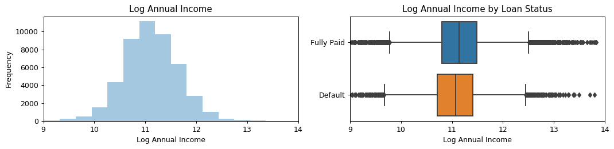


It seems that those with higher annual income are less risk

### Application Type (Categorical)
Indicates whether the loan is an individual application or a joint application with two co-borrowers


```python
print(dataset.groupby('loan_status')['application_type'].value_counts(dropna=False))
plot_var('application_type', 'Application Type', continuous=False, dataset=dataset)
```

    loan_status  application_type
    Default      Individual          17551
                 Joint App             943
    Fully Paid   Individual          27609
                 Joint App            1536
    Name: application_type, dtype: int64
    


There does not seem to be a strong correlation between risk and application_type. Both risk around the same percentage.

### Debt to Income Ratio (Numerical)
A ratio calculated using the borrower’s total monthly debt payments on the total debt obligations, excluding mortgage and the requested LC loan, divided by the borrower’s self-reported monthly income


```python
# dummy = dataset.loc[dataset['dti'].notnull() & (dataset['dti']<60), 'dti']
print(dataset.groupby('loan_status')['dti'].describe())
plot_var('dti', 'Debt To Income Ratio', continuous=True, dataset=dataset,
         x1limit=True, x2limit=True, x1l=0, x1u=40, x2l=0, x2u=60)
# sns.distplot(dataset.loc[dataset['dti'].notnull() & (dataset['dti']<60), 'dti'], kde=False)
# plt.xlabel('Debt-to-income Ratio')
# plt.ylabel('Count')
# plt.title('Debt-to-income Ratio')
```

                   count       mean        std  min    25%    50%    75%     max
    loan_status                                                                 
    Default      18486.0  20.346391  12.928459  0.0  13.77  19.98  26.31  886.77
    Fully Paid   29126.0  18.066659  13.751295  0.0  11.48  17.19  23.52  999.00
    


It seems that a higher debt to income ratio has a higher probability of charged off

### Delinquency (Categorical)
The number of 30+ days past-due incidences of delinquency in the borrower's credit file for the past 2 years


```python
dataset['delinq_2yrs'].values[dataset['delinq_2yrs'] > 1] = 2
print(dataset.groupby('loan_status')['delinq_2yrs'].value_counts(dropna=False))
plot_var('delinq_2yrs', 'Number of Delinquencies', continuous=False, dataset=dataset)
```

    loan_status  delinq_2yrs
    Default      0              14465
                 1               2587
                 2               1442
    Fully Paid   0              23444
                 1               3817
                 2               1884
    Name: delinq_2yrs, dtype: int64
    


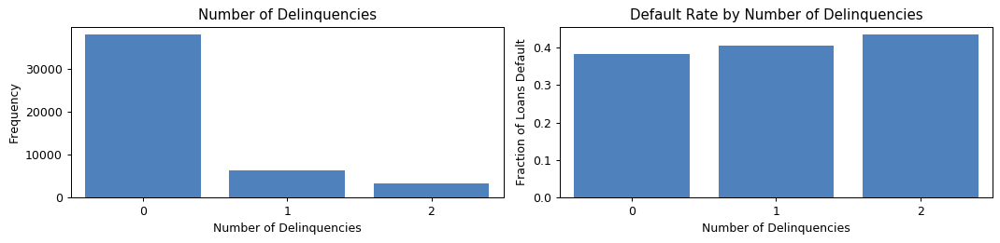


There seems to be an increasing trend in charge-off rate and increasing number of delinquencies but it is small. Whether or not this is significant remains to be seen.

### Earliest Credit Line (Numerical)
The month the borrower's earliest reported credit line was opened.


```python
# dataset['earliest_cr_line'] = pd.to_datetime(dataset['earliest_cr_line'], format='%b-%y').dt.year
dataset['earliest_cr_line'] = dataset['earliest_cr_line'].apply(lambda s: int(s[-2:]))
dataset.loc[dataset['earliest_cr_line'] > 20, 'earliest_cr_line'] += 1900
dataset.loc[dataset['earliest_cr_line'] < 20, 'earliest_cr_line'] += 2000
print(dataset.groupby('loan_status')['earliest_cr_line'].describe())
plot_var('earliest_cr_line', 'Earliest Credit Line', continuous=True, dataset=dataset)
```

                   count         mean       std     min     25%     50%     75%  \
    loan_status                                                                   
    Default      18494.0  2000.799773  7.758312  1953.0  1997.0  2002.0  2006.0   
    Fully Paid   29145.0  2000.470647  7.565745  1958.0  1997.0  2002.0  2005.0   
    
                    max  
    loan_status          
    Default      2014.0  
    Fully Paid   2014.0  
    


Surprisingly, when a person first obtained credit seems irrelevant.

### Employment Length (Categorical)
Employment length in years. Possible values are between 0 and 10 where 0 means less than one year and 10 means ten or more years.


```python
dataset['emp_length'].replace('< 1 year', 0, inplace=True)
dataset['emp_length'].replace('1 year', 1, inplace=True)
dataset['emp_length'].replace('2 years', 2, inplace=True)
dataset['emp_length'].replace('3 years', 3, inplace=True)
dataset['emp_length'].replace('4 years', 4, inplace=True)
dataset['emp_length'].replace('5 years', 5, inplace=True)
dataset['emp_length'].replace('6 years', 6, inplace=True)
dataset['emp_length'].replace('7 years', 7, inplace=True)
dataset['emp_length'].replace('8 years', 8, inplace=True)
dataset['emp_length'].replace('9 years', 9, inplace=True)
dataset['emp_length'].replace('10+ years', 10, inplace=True)
print(dataset.groupby('loan_status')['emp_length'].value_counts(dropna=False).sort_index())
plot_var('emp_length', 'Employment Length by Year', continuous=False, dataset=dataset)
```

    loan_status  emp_length
    Default      0.0            1541
                 1.0            1328
                 2.0            1823
                 3.0            1581
                 4.0            1099
                 5.0            1152
                 6.0             732
                 7.0             650
                 8.0             582
                 9.0             627
                 10.0           5630
                 NaN            1749
    Fully Paid   0.0            2454
                 1.0            1879
                 2.0            2654
                 3.0            2349
                 4.0            1793
                 5.0            1788
                 6.0            1311
                 7.0            1054
                 8.0             856
                 9.0            1101
                 10.0          10213
                 NaN            1693
    Name: emp_length, dtype: int64
    


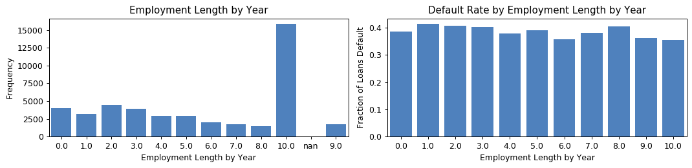


Doesn't seem to be much of a significant pattern here

### Home Ownership (Categorical)
The home ownership status provided by the borrower during registration or obtained from the credit report.


```python
# dataset['home_ownership'].replace(['NONE', 'ANY'], 'NaN', inplace=True)
dataset['home_ownership'].replace(['NONE', 'ANY'], 'MORTGAGE', inplace=True)
print(dataset.groupby('loan_status')['home_ownership'].value_counts(dropna=False))
plot_var('home_ownership', 'Home Ownership', continuous=False, dataset=dataset)
# dataset['home_ownership'].replace('NaN', np.nan, inplace=True)
```

    loan_status  home_ownership
    Default      RENT               8501
                 MORTGAGE           7781
                 OWN                2212
    Fully Paid   MORTGAGE          15652
                 RENT              10148
                 OWN                3345
    Name: home_ownership, dtype: int64
    


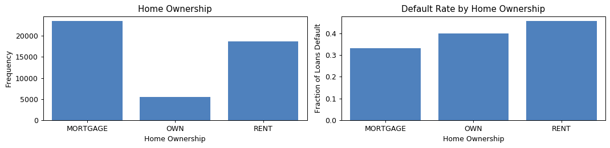


Interestingly those with a mortgage are more likely to pay off loans and those who rent are the least likely

### Initial List Status (Categorical)
The initial listing status of the loan. Possible values are – W, F


```python
print(dataset.groupby('loan_status')['initial_list_status'].value_counts(dropna=False))
plot_var('initial_list_status', 'Initial List Status', continuous=False, dataset=dataset)
```

    loan_status  initial_list_status
    Default      w                      12515
                 f                       5979
    Fully Paid   w                      21390
                 f                       7755
    Name: initial_list_status, dtype: int64
    


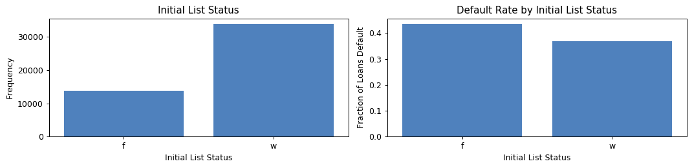


Theres does not seem to be much information gained from Initial List status

### Installment (Numerical)
The monthly payment owed by the borrower if the loan originates.


```python
print(dataset.groupby('loan_status')['installment'].describe())
plot_var('installment', 'Installment', continuous=True, dataset=dataset)
# since the plot is left skewed, we take the log transformation
dataset['log_installment'] = dataset['installment'].apply(lambda x: np.log(x + 1))
dataset.drop('installment', axis=1, inplace=True)
print(dataset.groupby('loan_status')['log_installment'].describe())
plot_var('log_installment', 'Log Installment', continuous=True, dataset=dataset)
```

                   count        mean         std    min     25%     50%     75%  \
    loan_status                                                                   
    Default      18494.0  490.309022  298.855772  30.99  271.45  410.35  659.43   
    Fully Paid   29145.0  420.773546  281.422908  30.12  212.75  341.41  559.44   
    
                     max  
    loan_status           
    Default      1566.80  
    Fully Paid   1587.23  
                   count      mean       std       min       25%       50%  \
    loan_status                                                              
    Default      18494.0  5.995530  0.676362  3.465423  5.607455  6.019444   
    Fully Paid   29145.0  5.811583  0.722315  3.437851  5.364807  5.836009   
    
                      75%       max  
    loan_status                      
    Default      6.492891  7.357429  
    Fully Paid   6.328722  7.370375  
    


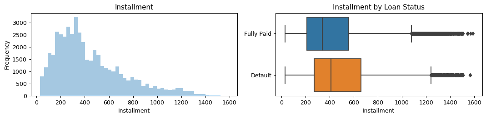


It seems those with higher installments are more likely to be charged off

### Interest Rate (Numerical)
Interest Rate on the loan


```python
dataset['int_rate'] = dataset['int_rate'].str.rstrip('%').astype('float')
print(dataset.groupby('loan_status')['int_rate'].describe())
plot_var('int_rate', 'Interest Rate', continuous=True, dataset=dataset)
```

                   count       mean       std   min    25%    50%    75%    max
    loan_status                                                                
    Default      18494.0  16.556265  5.858256  5.32  12.74  15.05  18.99  30.99
    Fully Paid   29145.0  13.215077  5.276465  5.32   9.93  12.62  15.99  30.99
    


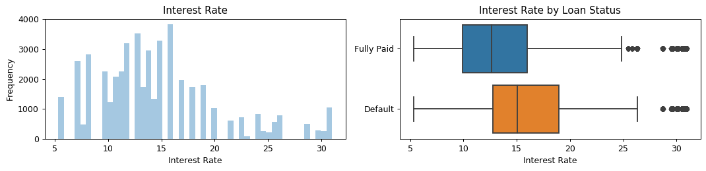


There seems to be a much higher interest rate on average for loans that charge off

### Loan Amount (Numerical)
The listed amount of the loan applied for by the borrower. If at some point in time, the credit department reduces the loan amount, then it will be reflected in this value.


```python
print(dataset.groupby('loan_status')['loan_amnt'].describe())
plot_var('loan_amnt', 'Loan Amount', continuous=True, dataset=dataset)
```

                   count          mean          std     min     25%      50%  \
    loan_status                                                                
    Default      18494.0  15645.820266  9411.036948  1000.0  8000.0  14000.0   
    Fully Paid   29145.0  13690.972723  9244.813927  1000.0  6400.0  11200.0   
    
                     75%      max  
    loan_status                    
    Default      21000.0  40000.0  
    Fully Paid   19200.0  40000.0  
    


It seems charged off loans have a higher loan amount

### Mortgage Accounts (Numerical)
Number of mortgage accounts


```python
dataset.loc[dataset['mort_acc'] > 9, 'mort_acc'] = 10
print(dataset.groupby('loan_status')['mort_acc'].value_counts(dropna=False))
plot_var('mort_acc', 'Mortgage Accounts', continuous=True, dataset=dataset)
```

    loan_status  mort_acc
    Default      0            9093
                 1            3457
                 2            2514
                 3            1639
                 4             914
                 5             475
                 6             216
                 7             100
                 8              42
                 9              28
                 10             16
    Fully Paid   0           11003
                 1            5592
                 2            4767
                 3            3288
                 4            2163
                 5            1118
                 6             608
                 7             290
                 8             171
                 10             80
                 9              65
    Name: mort_acc, dtype: int64
    


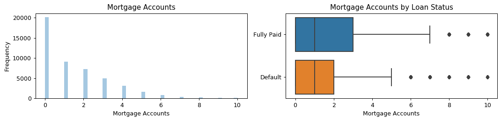


Currently there does not seem to be a significant difference

### Open Account (Numerical)
The number of open credit lines in the borrower's credit file.


```python
print(dataset.groupby('loan_status')['open_acc'].describe())
plot_var('open_acc', 'Open Credit Lines', continuous=True, dataset=dataset,
         x1limit=True, x2limit=True, x1l=0, x1u=40, x2l=0, x2u=30)
```

                   count       mean       std  min  25%   50%   75%   max
    loan_status                                                          
    Default      18494.0  11.944306  5.770755  1.0  8.0  11.0  15.0  68.0
    Fully Paid   29145.0  11.825630  5.743959  0.0  8.0  11.0  15.0  88.0
    


Does not seem to be a good indicator of risk

### Public Record (Categorical)
Number of derogatory public records


```python
dataset['pub_rec'] = pd.cut(dataset['pub_rec'], [0, 0.9, 25], labels=['None', 'At least one'], include_lowest=True)
print(dataset.groupby('loan_status')['pub_rec'].value_counts(dropna=False))
plot_var('pub_rec', 'Public Records', continuous=False, dataset=dataset)
```

    loan_status  pub_rec     
    Default      None            14254
                 At least one     4240
    Fully Paid   None            22937
                 At least one     6208
    Name: pub_rec, dtype: int64
    


Loan default rate does not seem to change much by derogatory public records

### Public Record of Bankruptcies (Categorical)
Number of public record bankruptcies


```python
dataset['pub_rec_bankruptcies'] = pd.cut(dataset['pub_rec_bankruptcies'], [0, 0.9, 25], 
                                         labels=['None', 'At least one'], include_lowest=True)
print(dataset.groupby('loan_status')['pub_rec_bankruptcies'].value_counts(dropna=False))
plot_var('pub_rec_bankruptcies', 'Bankruptcies', continuous=False, dataset=dataset)
```

    loan_status  pub_rec_bankruptcies
    Default      None                    15508
                 At least one             2986
    Fully Paid   None                    24732
                 At least one             4413
    Name: pub_rec_bankruptcies, dtype: int64
    


Loan default rate does not seem to change much by public bankruptcies records

### Purpose (Categorical)
A category provided by the borrower for the loan request


```python
dataset.groupby('purpose')['loan_status'].value_counts(normalize=True).loc[:, 'Default'].sort_values()
```


    purpose
    car                   0.294828
    home_improvement      0.323486
    vacation              0.330827
    house                 0.337255
    major_purchase        0.351542
    credit_card           0.368047
    other                 0.397081
    debt_consolidation    0.403409
    moving                0.415217
    renewable_energy      0.419355
    medical               0.420624
    small_business        0.577143
    Name: loan_status, dtype: float64


### Revolving Balance (Numerical)
Total credit revolving balance


```python
print(dataset.groupby('loan_status')['revol_bal'].describe())
plot_var('revol_bal', 'Revolving Balance in $', continuous=True, dataset=dataset,
         x1limit=True, x2limit=True, x1l=0, x1u=80000, x2l=0, x2u=40000)
# Seems like the data is heavily right skewed with a large range due to large outliers so we take the log transformation
dataset['log_revol_bal'] = dataset['revol_bal'].apply(lambda x: np.log(x + 1))
dataset.drop('revol_bal', axis=1, inplace=True)
print(dataset.groupby('loan_status')['log_revol_bal'].describe())
plot_var('log_revol_bal', 'Log Revolving Balance in $', continuous=True, dataset=dataset)
```

                   count          mean           std  min      25%      50%  \
    loan_status                                                               
    Default      18494.0  15708.679734  17434.382178  0.0  6293.25  11532.0   
    Fully Paid   29145.0  15601.315080  24339.574929  0.0  5176.00  10103.0   
    
                      75%        max  
    loan_status                       
    Default      19428.75   354794.0  
    Fully Paid   18214.00  1039013.0  
                   count      mean       std  min       25%       50%       75%  \
    loan_status                                                                   
    Default      18494.0  9.226252  1.132146  0.0  8.747392  9.352968  9.874561   
    Fully Paid   29145.0  9.078444  1.308805  0.0  8.551981  9.220687  9.810001   
    
                       max  
    loan_status             
    Default      12.779295  
    Fully Paid   13.853783  
    


There is not much difference in the two categories for revolving balances

### Revolving Utility (Numerical)
Revolving line utilization rate, or the amount of credit the borrower is using relative to all available revolving credit.


```python
dataset['revol_util'] = dataset['revol_util'].str.rstrip('%').astype('float')
print(dataset.groupby('loan_status')['revol_util'].describe())
plot_var('revol_util', 'Revolving Utility in %', continuous=True, dataset=dataset)
```

                   count       mean        std  min   25%   50%   75%    max
    loan_status                                                             
    Default      18488.0  52.649946  23.650179  0.0  35.3  52.9  70.3  138.9
    Fully Paid   29120.0  44.685968  24.521824  0.0  25.4  43.3  62.9  125.2
    


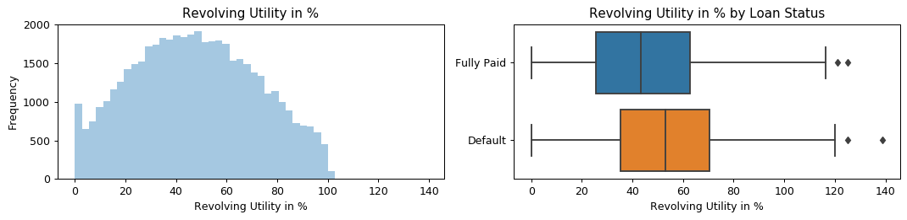


It seems those with a lower revolving utility are more likely to pay off their loans

### Grade (Categorical)
LendingClub assigned loan grade. The higher the letter, the safer the loan.


```python
plot_var('grade', 'Grade', continuous=False, dataset=dataset)
```


There seems to be a strong trend between charge off rate and deteriorating grade

### Term (Categorical)
The number of payments on the loan. Values are in months and can be either 36 or 60


```python
# dataset['term'].replace('36 months', 36, inplace=True)
# dataset['term'].replace('60 months', 60, inplace=True)
dataset['term'] = dataset['term'].apply(lambda s: np.int8(s.split()[0]))
print(dataset.groupby('loan_status')['term'].value_counts(dropna=False))
plot_var('term', 'Term (months)', continuous=False, dataset=dataset)
```

    loan_status  term
    Default      36      12599
                 60       5895
    Fully Paid   36      23073
                 60       6072
    Name: term, dtype: int64
    


Loan Duration or how long to maturity seems to be important and a good indicator of risk of default. A longer duration has a higher risk that the loan will not be repaid.  

### Total Accounts (Numerical)
The total number of credit lines currently in the borrower's credit file


```python
print(dataset.groupby('loan_status')['total_acc'].describe())
plot_var('total_acc', 'Number of Total Accounts', continuous=True, dataset=dataset)
```

                   count       mean        std  min   25%   50%   75%    max
    loan_status                                                             
    Default      18494.0  23.766843  11.858529  2.0  15.0  22.0  30.0  121.0
    Fully Paid   29145.0  24.859633  12.233984  2.0  16.0  23.0  31.0  146.0
    


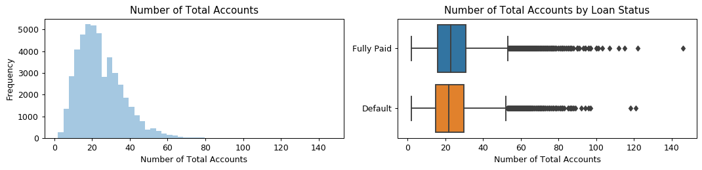


There does not seem to be a significant difference in charge off rate depending on the total account number

### Verification Status (Categorical)
Indicates if income was verified, not verified, or if the income source was verified.


```python
print(dataset.groupby('loan_status')['verification_status'].value_counts(dropna=False))
plot_var('verification_status', 'Verification Status', continuous=False, dataset=dataset)
```

    loan_status  verification_status
    Default      Source Verified         7559
                 Verified                6761
                 Not Verified            4174
    Fully Paid   Source Verified        11607
                 Not Verified           10330
                 Verified                7208
    Name: verification_status, dtype: int64
    


There seems to be a strong linear trend between charged off rate and verification status. Surprisingly, loans with a status of verified have a higher chance of becoming charged off.

# Preliminary Model Design

### Create dummy variables
1(negative class) means charged-off and 0(positive class) means fully paid and create dummy variables for all categorical variables


```python
dataset['loan_status'].replace('Default', 1, inplace=True)
dataset['loan_status'].replace('Fully Paid', 0, inplace=True)

dataset = pd.get_dummies(dataset, columns=['grade', 'home_ownership', 'verification_status', 'purpose', 
                                           'initial_list_status', 'application_type', 'pub_rec', 
                                           'pub_rec_bankruptcies'], drop_first=True)
dataset.head()
```


<div>
<style scoped>
    .dataframe tbody tr th:only-of-type {
        vertical-align: middle;
    }

    .dataframe tbody tr th {
        vertical-align: top;
    }

    .dataframe thead th {
        text-align: right;
    }
</style>
<table border="1" class="dataframe">
  <thead>
    <tr style="text-align: right;">
      <th></th>
      <th>loan_amnt</th>
      <th>term</th>
      <th>int_rate</th>
      <th>emp_length</th>
      <th>loan_status</th>
      <th>dti</th>
      <th>delinq_2yrs</th>
      <th>earliest_cr_line</th>
      <th>open_acc</th>
      <th>revol_util</th>
      <th>total_acc</th>
      <th>total_pymnt</th>
      <th>mort_acc</th>
      <th>log_annual_inc</th>
      <th>log_installment</th>
      <th>log_revol_bal</th>
      <th>grade_B</th>
      <th>grade_C</th>
      <th>grade_D</th>
      <th>grade_E</th>
      <th>grade_F</th>
      <th>grade_G</th>
      <th>home_ownership_OWN</th>
      <th>home_ownership_RENT</th>
      <th>verification_status_Source Verified</th>
      <th>verification_status_Verified</th>
      <th>purpose_credit_card</th>
      <th>purpose_debt_consolidation</th>
      <th>purpose_home_improvement</th>
      <th>purpose_house</th>
      <th>purpose_major_purchase</th>
      <th>purpose_medical</th>
      <th>purpose_moving</th>
      <th>purpose_other</th>
      <th>purpose_renewable_energy</th>
      <th>purpose_small_business</th>
      <th>purpose_vacation</th>
      <th>initial_list_status_w</th>
      <th>application_type_Joint App</th>
      <th>pub_rec_At least one</th>
      <th>pub_rec_bankruptcies_At least one</th>
    </tr>
  </thead>
  <tbody>
    <tr>
      <th>0</th>
      <td>5000</td>
      <td>36</td>
      <td>7.35</td>
      <td>5.0</td>
      <td>0</td>
      <td>15.76</td>
      <td>0</td>
      <td>2004</td>
      <td>12</td>
      <td>13.2</td>
      <td>25</td>
      <td>5385.245133</td>
      <td>1</td>
      <td>11.002117</td>
      <td>5.051073</td>
      <td>8.215547</td>
      <td>0</td>
      <td>0</td>
      <td>0</td>
      <td>0</td>
      <td>0</td>
      <td>0</td>
      <td>0</td>
      <td>0</td>
      <td>0</td>
      <td>0</td>
      <td>0</td>
      <td>0</td>
      <td>0</td>
      <td>0</td>
      <td>0</td>
      <td>0</td>
      <td>0</td>
      <td>0</td>
      <td>0</td>
      <td>0</td>
      <td>0</td>
      <td>1</td>
      <td>0</td>
      <td>0</td>
      <td>0</td>
    </tr>
    <tr>
      <th>1</th>
      <td>7500</td>
      <td>36</td>
      <td>7.35</td>
      <td>7.0</td>
      <td>0</td>
      <td>13.12</td>
      <td>0</td>
      <td>2013</td>
      <td>19</td>
      <td>27.2</td>
      <td>27</td>
      <td>7642.289180</td>
      <td>4</td>
      <td>11.608245</td>
      <td>5.454423</td>
      <td>10.058309</td>
      <td>0</td>
      <td>0</td>
      <td>0</td>
      <td>0</td>
      <td>0</td>
      <td>0</td>
      <td>0</td>
      <td>0</td>
      <td>0</td>
      <td>0</td>
      <td>0</td>
      <td>1</td>
      <td>0</td>
      <td>0</td>
      <td>0</td>
      <td>0</td>
      <td>0</td>
      <td>0</td>
      <td>0</td>
      <td>0</td>
      <td>0</td>
      <td>1</td>
      <td>0</td>
      <td>0</td>
      <td>0</td>
    </tr>
    <tr>
      <th>2</th>
      <td>9600</td>
      <td>36</td>
      <td>7.97</td>
      <td>0.0</td>
      <td>0</td>
      <td>18.34</td>
      <td>0</td>
      <td>2005</td>
      <td>16</td>
      <td>48.6</td>
      <td>44</td>
      <td>10283.629660</td>
      <td>3</td>
      <td>11.849405</td>
      <td>5.709433</td>
      <td>9.376617</td>
      <td>0</td>
      <td>0</td>
      <td>0</td>
      <td>0</td>
      <td>0</td>
      <td>0</td>
      <td>1</td>
      <td>0</td>
      <td>0</td>
      <td>0</td>
      <td>1</td>
      <td>0</td>
      <td>0</td>
      <td>0</td>
      <td>0</td>
      <td>0</td>
      <td>0</td>
      <td>0</td>
      <td>0</td>
      <td>0</td>
      <td>0</td>
      <td>1</td>
      <td>0</td>
      <td>0</td>
      <td>0</td>
    </tr>
    <tr>
      <th>3</th>
      <td>2000</td>
      <td>36</td>
      <td>7.07</td>
      <td>2.0</td>
      <td>0</td>
      <td>12.15</td>
      <td>0</td>
      <td>2005</td>
      <td>9</td>
      <td>0.3</td>
      <td>12</td>
      <td>2097.014574</td>
      <td>0</td>
      <td>11.289794</td>
      <td>4.140273</td>
      <td>3.663562</td>
      <td>0</td>
      <td>0</td>
      <td>0</td>
      <td>0</td>
      <td>0</td>
      <td>0</td>
      <td>0</td>
      <td>1</td>
      <td>0</td>
      <td>0</td>
      <td>0</td>
      <td>0</td>
      <td>0</td>
      <td>0</td>
      <td>0</td>
      <td>1</td>
      <td>0</td>
      <td>0</td>
      <td>0</td>
      <td>0</td>
      <td>0</td>
      <td>1</td>
      <td>0</td>
      <td>0</td>
      <td>0</td>
    </tr>
    <tr>
      <th>4</th>
      <td>7200</td>
      <td>36</td>
      <td>24.85</td>
      <td>2.0</td>
      <td>0</td>
      <td>6.07</td>
      <td>0</td>
      <td>2000</td>
      <td>4</td>
      <td>98.9</td>
      <td>5</td>
      <td>7206.461000</td>
      <td>0</td>
      <td>10.819798</td>
      <td>5.658436</td>
      <td>8.177797</td>
      <td>0</td>
      <td>0</td>
      <td>0</td>
      <td>1</td>
      <td>0</td>
      <td>0</td>
      <td>0</td>
      <td>1</td>
      <td>1</td>
      <td>0</td>
      <td>0</td>
      <td>1</td>
      <td>0</td>
      <td>0</td>
      <td>0</td>
      <td>0</td>
      <td>0</td>
      <td>0</td>
      <td>0</td>
      <td>0</td>
      <td>0</td>
      <td>1</td>
      <td>0</td>
      <td>0</td>
      <td>0</td>
    </tr>
  </tbody>
</table>
</div>


### Split the data


```python
dataset.dropna(inplace=True)
# dataset.fillna(lambda x: x.median())
y = dataset.loc[:, dataset.columns == 'loan_status']
x = dataset.loc[:, dataset.columns != 'loan_status']
# y = dataset['loan_status']
# X = dataset.drop(columns=['loan_status'])
x_train, x_test, y_train, y_test = train_test_split(x, y, test_size=0.3, random_state=0, 
                                                    stratify=dataset['loan_status'])

x_train.drop('total_pymnt', axis=1, inplace=True)
test_pymnts = x_test.loc[:, x_test.columns == 'total_pymnt']
x_test.drop('total_pymnt', axis=1, inplace=True)

# x_train = x_train.reset_index()
# y_train = y_train.reset_index()
```

    c:\users\leon\miniconda3\envs\aiml\lib\site-packages\pandas\core\frame.py:3940: SettingWithCopyWarning: 
    A value is trying to be set on a copy of a slice from a DataFrame
    
    See the caveats in the documentation: http://pandas.pydata.org/pandas-docs/stable/indexing.html#indexing-view-versus-copy
      errors=errors)
    

# Feature Selection and Model Fitting

### Logistic Regression Model

### Base


```python
model_lr_base = LogisticRegression(penalty="l2", 
                              C=0.5, 
                              fit_intercept=True, 
                              random_state=0, 
                              max_iter=10000, 
                              solver='lbfgs')
model_lr_base.fit(x_train, y_train.values.ravel())
```


    LogisticRegression(C=0.5, class_weight=None, dual=False, fit_intercept=True,
                       intercept_scaling=1, l1_ratio=None, max_iter=10000,
                       multi_class='auto', n_jobs=None, penalty='l2',
                       random_state=0, solver='lbfgs', tol=0.0001, verbose=0,
                       warm_start=False)


### Cost Sensitive Method


```python
model_lr = LogisticRegression(penalty="l2", 
                              C=0.5, 
                              fit_intercept=True, 
                              class_weight='balanced', 
                              random_state=0, 
                              max_iter=10000, 
                              solver='lbfgs')
model_lr = model_lr.fit(x_train, y_train.values.ravel())
```


```python
import statsmodels.api as sm
logit_model = sm.Logit(y, x)
result = logit_model.fit()
result.summary2()
```

    Optimization terminated successfully.
             Current function value: 0.015635
             Iterations 14
    


<table class="simpletable">
<tr>
        <td>Model:</td>              <td>Logit</td>      <td>Pseudo R-squared:</td>   <td>0.976</td>  
</tr>
<tr>
  <td>Dependent Variable:</td>    <td>loan_status</td>         <td>AIC:</td>        <td>1461.1080</td>
</tr>
<tr>
         <td>Date:</td>        <td>2019-10-15 11:46</td>       <td>BIC:</td>        <td>1808.9373</td>
</tr>
<tr>
   <td>No. Observations:</td>        <td>44167</td>       <td>Log-Likelihood:</td>   <td>-690.55</td> 
</tr>
<tr>
       <td>Df Model:</td>             <td>39</td>            <td>LL-Null:</td>       <td>-29308.</td> 
</tr>
<tr>
     <td>Df Residuals:</td>          <td>44127</td>        <td>LLR p-value:</td>     <td>0.0000</td>  
</tr>
<tr>
      <td>Converged:</td>           <td>1.0000</td>           <td>Scale:</td>        <td>1.0000</td>  
</tr>
<tr>
    <td>No. Iterations:</td>        <td>14.0000</td>             <td></td>              <td></td>     
</tr>
</table>
<table class="simpletable">
<tr>
                   <td></td>                    <th>Coef.</th>  <th>Std.Err.</th>     <th>z</th>     <th>P>|z|</th> <th>[0.025</th>  <th>0.975]</th> 
</tr>
<tr>
  <th>loan_amnt</th>                           <td>0.0051</td>   <td>0.0002</td>   <td>31.9155</td> <td>0.0000</td> <td>0.0048</td>  <td>0.0054</td> 
</tr>
<tr>
  <th>term</th>                                <td>-0.0512</td>  <td>0.0184</td>   <td>-2.7819</td> <td>0.0054</td> <td>-0.0873</td> <td>-0.0151</td>
</tr>
<tr>
  <th>int_rate</th>                            <td>0.0638</td>   <td>0.0724</td>   <td>0.8804</td>  <td>0.3787</td> <td>-0.0782</td> <td>0.2057</td> 
</tr>
<tr>
  <th>emp_length</th>                          <td>-0.0012</td>  <td>0.0230</td>   <td>-0.0522</td> <td>0.9584</td> <td>-0.0463</td> <td>0.0439</td> 
</tr>
<tr>
  <th>dti</th>                                 <td>0.0084</td>   <td>0.0106</td>   <td>0.7943</td>  <td>0.4270</td> <td>-0.0123</td> <td>0.0291</td> 
</tr>
<tr>
  <th>delinq_2yrs</th>                         <td>0.2104</td>   <td>0.1332</td>   <td>1.5791</td>  <td>0.1143</td> <td>-0.0507</td> <td>0.4715</td> 
</tr>
<tr>
  <th>earliest_cr_line</th>                    <td>0.0025</td>   <td>0.0012</td>   <td>2.0681</td>  <td>0.0386</td> <td>0.0001</td>  <td>0.0049</td> 
</tr>
<tr>
  <th>open_acc</th>                            <td>0.0415</td>   <td>0.0222</td>   <td>1.8681</td>  <td>0.0617</td> <td>-0.0020</td> <td>0.0850</td> 
</tr>
<tr>
  <th>revol_util</th>                          <td>0.0105</td>   <td>0.0042</td>   <td>2.5282</td>  <td>0.0115</td> <td>0.0024</td>  <td>0.0186</td> 
</tr>
<tr>
  <th>total_acc</th>                           <td>-0.0107</td>  <td>0.0107</td>   <td>-0.9991</td> <td>0.3178</td> <td>-0.0316</td> <td>0.0103</td> 
</tr>
<tr>
  <th>total_pymnt</th>                         <td>-0.0049</td>  <td>0.0002</td>  <td>-31.3356</td> <td>0.0000</td> <td>-0.0052</td> <td>-0.0046</td>
</tr>
<tr>
  <th>mort_acc</th>                            <td>0.0110</td>   <td>0.0647</td>   <td>0.1702</td>  <td>0.8649</td> <td>-0.1158</td> <td>0.1378</td> 
</tr>
<tr>
  <th>log_annual_inc</th>                      <td>-0.2491</td>  <td>0.1977</td>   <td>-1.2598</td> <td>0.2077</td> <td>-0.6366</td> <td>0.1384</td> 
</tr>
<tr>
  <th>log_installment</th>                     <td>-1.5293</td>  <td>0.1870</td>   <td>-8.1799</td> <td>0.0000</td> <td>-1.8958</td> <td>-1.1629</td>
</tr>
<tr>
  <th>log_revol_bal</th>                       <td>-0.0575</td>  <td>0.0783</td>   <td>-0.7340</td> <td>0.4629</td> <td>-0.2109</td> <td>0.0960</td> 
</tr>
<tr>
  <th>grade_B</th>                             <td>0.3078</td>   <td>0.4038</td>   <td>0.7623</td>  <td>0.4459</td> <td>-0.4836</td> <td>1.0992</td> 
</tr>
<tr>
  <th>grade_C</th>                             <td>0.7029</td>   <td>0.5883</td>   <td>1.1947</td>  <td>0.2322</td> <td>-0.4502</td> <td>1.8559</td> 
</tr>
<tr>
  <th>grade_D</th>                             <td>1.0094</td>   <td>0.8874</td>   <td>1.1374</td>  <td>0.2554</td> <td>-0.7299</td> <td>2.7486</td> 
</tr>
<tr>
  <th>grade_E</th>                             <td>0.8045</td>   <td>1.3145</td>   <td>0.6120</td>  <td>0.5405</td> <td>-1.7718</td> <td>3.3809</td> 
</tr>
<tr>
  <th>grade_F</th>                             <td>0.2924</td>   <td>1.7724</td>   <td>0.1650</td>  <td>0.8690</td> <td>-3.1814</td> <td>3.7662</td> 
</tr>
<tr>
  <th>grade_G</th>                             <td>1.8290</td>   <td>1.8524</td>   <td>0.9874</td>  <td>0.3235</td> <td>-1.8016</td> <td>5.4596</td> 
</tr>
<tr>
  <th>home_ownership_OWN</th>                  <td>0.2594</td>   <td>0.2551</td>   <td>1.0171</td>  <td>0.3091</td> <td>-0.2405</td> <td>0.7593</td> 
</tr>
<tr>
  <th>home_ownership_RENT</th>                 <td>0.0827</td>   <td>0.2142</td>   <td>0.3859</td>  <td>0.6996</td> <td>-0.3372</td> <td>0.5025</td> 
</tr>
<tr>
  <th>verification_status_Source Verified</th> <td>0.3925</td>   <td>0.2123</td>   <td>1.8489</td>  <td>0.0645</td> <td>-0.0236</td> <td>0.8086</td> 
</tr>
<tr>
  <th>verification_status_Verified</th>        <td>0.2522</td>   <td>0.2488</td>   <td>1.0135</td>  <td>0.3108</td> <td>-0.2355</td> <td>0.7399</td> 
</tr>
<tr>
  <th>purpose_credit_card</th>                 <td>0.5843</td>   <td>0.7025</td>   <td>0.8318</td>  <td>0.4055</td> <td>-0.7925</td> <td>1.9611</td> 
</tr>
<tr>
  <th>purpose_debt_consolidation</th>          <td>0.4451</td>   <td>0.6784</td>   <td>0.6561</td>  <td>0.5118</td> <td>-0.8846</td> <td>1.7748</td> 
</tr>
<tr>
  <th>purpose_home_improvement</th>            <td>0.7780</td>   <td>0.7137</td>   <td>1.0900</td>  <td>0.2757</td> <td>-0.6209</td> <td>2.1769</td> 
</tr>
<tr>
  <th>purpose_house</th>                       <td>0.6895</td>   <td>1.0535</td>   <td>0.6545</td>  <td>0.5128</td> <td>-1.3754</td> <td>2.7543</td> 
</tr>
<tr>
  <th>purpose_major_purchase</th>              <td>0.2848</td>   <td>0.8008</td>   <td>0.3557</td>  <td>0.7221</td> <td>-1.2846</td> <td>1.8543</td> 
</tr>
<tr>
  <th>purpose_medical</th>                     <td>0.6742</td>   <td>0.7594</td>   <td>0.8878</td>  <td>0.3747</td> <td>-0.8143</td> <td>2.1627</td> 
</tr>
<tr>
  <th>purpose_moving</th>                      <td>0.2560</td>   <td>0.8431</td>   <td>0.3037</td>  <td>0.7614</td> <td>-1.3964</td> <td>1.9085</td> 
</tr>
<tr>
  <th>purpose_other</th>                       <td>0.4449</td>   <td>0.6903</td>   <td>0.6446</td>  <td>0.5192</td> <td>-0.9080</td> <td>1.7978</td> 
</tr>
<tr>
  <th>purpose_renewable_energy</th>            <td>0.4863</td>   <td>1.5947</td>   <td>0.3050</td>  <td>0.7604</td> <td>-2.6393</td> <td>3.6119</td> 
</tr>
<tr>
  <th>purpose_small_business</th>              <td>0.0845</td>   <td>1.1135</td>   <td>0.0759</td>  <td>0.9395</td> <td>-2.0979</td> <td>2.2669</td> 
</tr>
<tr>
  <th>purpose_vacation</th>                    <td>0.5522</td>   <td>0.7479</td>   <td>0.7383</td>  <td>0.4603</td> <td>-0.9137</td> <td>2.0181</td> 
</tr>
<tr>
  <th>initial_list_status_w</th>               <td>-0.0366</td>  <td>0.1820</td>   <td>-0.2011</td> <td>0.8407</td> <td>-0.3933</td> <td>0.3202</td> 
</tr>
<tr>
  <th>application_type_Joint App</th>          <td>-0.1060</td>  <td>0.5709</td>   <td>-0.1857</td> <td>0.8527</td> <td>-1.2250</td> <td>1.0129</td> 
</tr>
<tr>
  <th>pub_rec_At least one</th>                <td>0.1432</td>   <td>0.3356</td>   <td>0.4266</td>  <td>0.6697</td> <td>-0.5146</td> <td>0.8010</td> 
</tr>
<tr>
  <th>pub_rec_bankruptcies_At least one</th>   <td>0.2980</td>   <td>0.3795</td>   <td>0.7853</td>  <td>0.4323</td> <td>-0.4458</td> <td>1.0419</td> 
</tr>
</table>


We remove all variables with p-value less than 0.05


```python
result.pvalues[result.pvalues > 0.05]
```


    int_rate                               0.378662
    emp_length                             0.958403
    dti                                    0.427021
    delinq_2yrs                            0.114316
    open_acc                               0.061749
    total_acc                              0.317753
    mort_acc                               0.864878
    log_annual_inc                         0.207726
    log_revol_bal                          0.462941
    grade_B                                0.445874
    grade_C                                0.232199
    grade_D                                0.255358
    grade_E                                0.540510
    grade_F                                0.868953
    grade_G                                0.323465
    home_ownership_OWN                     0.309099
    home_ownership_RENT                    0.699561
    verification_status_Source Verified    0.064475
    verification_status_Verified           0.310800
    purpose_credit_card                    0.405548
    purpose_debt_consolidation             0.511758
    purpose_home_improvement               0.275716
    purpose_house                          0.512816
    purpose_major_purchase                 0.722068
    purpose_medical                        0.374669
    purpose_moving                         0.761364
    purpose_other                          0.519200
    purpose_renewable_energy               0.760395
    purpose_small_business                 0.939501
    purpose_vacation                       0.460320
    initial_list_status_w                  0.840654
    application_type_Joint App             0.852687
    pub_rec_At least one                   0.669658
    pub_rec_bankruptcies_At least one      0.432271
    dtype: float64


```python
keep_list = list(result.pvalues[result.pvalues < 0.05].index)
keep_list.append('loan_status')
drop_list = [col for col in dataset.columns if col not in keep_list]
x_train_lr = x_train.drop(labels=drop_list, axis=1)
x_test_lr = x_test.drop(labels=drop_list, axis=1)
model_lr2 = LogisticRegression(penalty="l2", C=0.5, fit_intercept=True, class_weight='balanced',
                               random_state=0, max_iter=10000, solver='lbfgs')
model_lr2.fit(x_train_lr, y_train.values.ravel())
```


    LogisticRegression(C=0.5, class_weight='balanced', dual=False,
                       fit_intercept=True, intercept_scaling=1, l1_ratio=None,
                       max_iter=10000, multi_class='auto', n_jobs=None,
                       penalty='l2', random_state=0, solver='lbfgs', tol=0.0001,
                       verbose=0, warm_start=False)


### Sampling Method - SMOTE


```python
x_train_lr_sm, y_train_sm = SMOTE(random_state=1).fit_resample(x_train, y_train.values.ravel())
model_lr_smote = LogisticRegression(penalty="l2", 
                              C=0.5, 
                              fit_intercept=True, 
                              random_state=0, 
                              max_iter=10000, 
                              solver='lbfgs')
model_lr_smote.fit(x_train_lr_sm, y_train_sm)
```


    LogisticRegression(C=0.5, class_weight=None, dual=False, fit_intercept=True,
                       intercept_scaling=1, l1_ratio=None, max_iter=10000,
                       multi_class='auto', n_jobs=None, penalty='l2',
                       random_state=0, solver='lbfgs', tol=0.0001, verbose=0,
                       warm_start=False)


### Sampling Method - ADASYN


```python
x_train_lr_as, y_train_as = ADASYN(random_state=1).fit_sample(x_train, y_train.values.ravel())
model_lr_adasyn = LogisticRegression(penalty="l2", 
                                     C=0.5, fit_intercept=True, 
                                     random_state=0, 
                                     max_iter=10000, 
                                     solver='lbfgs')
model_lr_adasyn.fit(x_train_lr_as, y_train_as)
```


    LogisticRegression(C=0.5, class_weight=None, dual=False, fit_intercept=True,
                       intercept_scaling=1, l1_ratio=None, max_iter=10000,
                       multi_class='auto', n_jobs=None, penalty='l2',
                       random_state=0, solver='lbfgs', tol=0.0001, verbose=0,
                       warm_start=False)


### Logistic Regression Results

### Base


```python
# Make predictions and determine the error
y_pred_lr = model_lr_base.predict(x_test)
print("Accuracy: %.2f%%" % (model_lr_base.score(x_test, y_test) * 100))
print(confusion_matrix(y_test, y_pred_lr))
print('F1 Score:', f1_score(y_test, y_pred_lr))
print(classification_report(y_test, y_pred_lr))
# predict probabilities
prob = model_lr_base.predict_proba(x_test)
# keep probabilities for the positive outcome only
preds = prob[:,1]
# calculate pr curve
precision_lr, recall_lr, threshold = precision_recall_curve(y_test, preds)
# calculate auc, equivalent to roc_auc_score()?
print('PR-AUC: ', auc(recall_lr, precision_lr))
```

    Accuracy: 65.70%
    [[7134 1095]
     [3450 1572]]
    F1 Score: 0.4088958252048381
                  precision    recall  f1-score   support
    
               0       0.67      0.87      0.76      8229
               1       0.59      0.31      0.41      5022
    
        accuracy                           0.66     13251
       macro avg       0.63      0.59      0.58     13251
    weighted avg       0.64      0.66      0.63     13251
    
    PR-AUC:  0.5464040971217461
    

### Cost Sensitive Method


```python
# Make predictions and determine the error
y_pred_lr = model_lr.predict(x_test)
print("Accuracy: %.2f%%" % (model_lr.score(x_test, y_test) * 100))
print(confusion_matrix(y_test, y_pred_lr))
print('F1 Score:', f1_score(y_test, y_pred_lr))
print(classification_report(y_test, y_pred_lr))
# predict probabilities
prob = model_lr.predict_proba(x_test)
# keep probabilities for the positive outcome only
preds = prob[:,1]
# calculate pr curve
precision_lr, recall_lr, threshold = precision_recall_curve(y_test, preds)
# calculate auc, equivalent to roc_auc_score()?
print('PR-AUC: ', auc(recall_lr, precision_lr))
```

    Accuracy: 64.03%
    [[5503 2726]
     [2041 2981]]
    F1 Score: 0.5556901854786094
                  precision    recall  f1-score   support
    
               0       0.73      0.67      0.70      8229
               1       0.52      0.59      0.56      5022
    
        accuracy                           0.64     13251
       macro avg       0.63      0.63      0.63     13251
    weighted avg       0.65      0.64      0.64     13251
    
    PR-AUC:  0.5464973303519882
    


```python
y_pred_lr2 = model_lr2.predict(x_test_lr)
print("Accuracy: %.2f%%" % (model_lr2.score(x_test_lr, y_test) * 100))
print(confusion_matrix(y_test, y_pred_lr2))
print('F1 Score:', f1_score(y_test, y_pred_lr2))
print(classification_report(y_test, y_pred_lr2))
prob = model_lr2.predict_proba(x_test_lr)
# keep probabilities for the positive outcome only
preds = prob[:,1]
# calculate pr curve
precision_lr, recall_lr, threshold = precision_recall_curve(y_test, preds)
# calculate auc, equivalent to roc_auc_score()?
print('PR-AUC: ', auc(recall_lr, precision_lr))
```

    Accuracy: 58.94%
    [[4733 3496]
     [1945 3077]]
    F1 Score: 0.5307460112117292
                  precision    recall  f1-score   support
    
               0       0.71      0.58      0.64      8229
               1       0.47      0.61      0.53      5022
    
        accuracy                           0.59     13251
       macro avg       0.59      0.59      0.58     13251
    weighted avg       0.62      0.59      0.60     13251
    
    PR-AUC:  0.4993774441315906
    


```python
# manually picked
important_indices = ['log_annual_inc',
                     'dti',
                     'home_ownership_OWN',
                     'home_ownership_RENT',
                     'log_installment',
                     'int_rate',
                     'loan_amnt',
                     'revol_util',
                     'grade_B',
                     'grade_C',
                     'grade_D',
                     'grade_E',
                     'grade_F',
                     'grade_G',
                     'term',
                     'verification_status_Source Verified',
                     'verification_status_Verified']
x_train_lr = x_train.loc[:, important_indices]
x_test_lr = x_test.loc[:, important_indices]
model_lr3 = LogisticRegression(penalty="l2", C=0.5, fit_intercept=True, class_weight='balanced',
                               random_state=0, max_iter=10000, solver='lbfgs')
model_lr3 = model_lr3.fit(x_train_lr, y_train.values.ravel())
y_pred_lr = model_lr3.predict(x_test_lr)
print("Accuracy: %.2f%%" % (model_lr3.score(x_test_lr, y_test) * 100))
confusion_matrix(y_test, y_pred_lr)
print('F1 Score:', f1_score(y_test, y_pred_lr))
print(classification_report(y_test, y_pred_lr))
# predict probabilities
prob = model_lr3.predict_proba(x_test_lr)
# keep probabilities for the positive outcome only
preds = prob[:,1]
# calculate pr curve
precision_lr, recall_lr, threshold = precision_recall_curve(y_test, preds)
# calculate auc, equivalent to roc_auc_score()?
print('PR-AUC: ', auc(recall_lr, precision_lr))
```

    Accuracy: 63.86%
    F1 Score: 0.5538891476478808
                  precision    recall  f1-score   support
    
               0       0.73      0.67      0.70      8229
               1       0.52      0.59      0.55      5022
    
        accuracy                           0.64     13251
       macro avg       0.62      0.63      0.63     13251
    weighted avg       0.65      0.64      0.64     13251
    
    PR-AUC:  0.5416129481431338
    

### Sampling Method - SMOTE


```python
# Make predictions and determine the error
y_pred_lr = model_lr_smote.predict(x_test)
print("Accuracy: %.2f%%" % (model_lr_smote.score(x_test, y_test) * 100))
print(confusion_matrix(y_test, y_pred_lr))
print('F1 Score:', f1_score(y_test, y_pred_lr))
print(classification_report(y_test, y_pred_lr))
# predict probabilities
prob = model_lr_smote.predict_proba(x_test)
# keep probabilities for the positive outcome only
preds = prob[:,1]
# calculate pr curve
precision_lr, recall_lr, threshold = precision_recall_curve(y_test, preds)
# calculate auc, equivalent to roc_auc_score()?
print('PR-AUC: ', auc(recall_lr, precision_lr))
```

    Accuracy: 64.49%
    [[5376 2853]
     [1852 3170]]
    F1 Score: 0.5740153915799003
                  precision    recall  f1-score   support
    
               0       0.74      0.65      0.70      8229
               1       0.53      0.63      0.57      5022
    
        accuracy                           0.64     13251
       macro avg       0.64      0.64      0.63     13251
    weighted avg       0.66      0.64      0.65     13251
    
    PR-AUC:  0.558655682201526
    

### Sampling Method - ADASYN


```python
# Make predictions and determine the error
y_pred_lr = model_lr_adasyn.predict(x_test)
print("Accuracy: %.2f%%" % (model_lr_adasyn.score(x_test, y_test) * 100))
print(confusion_matrix(y_test, y_pred_lr))
print('F1 Score:', f1_score(y_test, y_pred_lr))
print(classification_report(y_test, y_pred_lr))
# predict probabilities
prob = model_lr_adasyn.predict_proba(x_test)
# keep probabilities for the positive outcome only
preds = prob[:,1]
# calculate pr curve
precision_lr, recall_lr, threshold = precision_recall_curve(y_test, preds)
# calculate auc, equivalent to roc_auc_score()?
print('PR-AUC: ', auc(recall_lr, precision_lr))
```

    Accuracy: 63.95%
    [[5434 2795]
     [1982 3040]]
    F1 Score: 0.5600073685180068
                  precision    recall  f1-score   support
    
               0       0.73      0.66      0.69      8229
               1       0.52      0.61      0.56      5022
    
        accuracy                           0.64     13251
       macro avg       0.63      0.63      0.63     13251
    weighted avg       0.65      0.64      0.64     13251
    
    PR-AUC:  0.5459631714046866
    

### Random Forest Model


```python
model_rf_path = Path('../data/model_rf.joblib')
if os.path.exists(model_rf_path): # list of features files does not exist dont save model
    model_rf = load(model_rf_path)
else:
    n_trees = [50, 100, 250, 500, 1000, 1500, 2500]
    rf_dict = dict.fromkeys(n_trees)
    for num in n_trees:
        print(num)
        rf = RandomForestClassifier(n_estimators=num,
                                    min_samples_leaf=30,
                                    oob_score=True,
                                    random_state=100,
                                    class_weight='balanced',
                                    n_jobs=-1)
        rf.fit(x_train, y_train.values.ravel())
        rf_dict[num] = rf

    oob_error_list = [None] * len(n_trees)

    for i in range(len(n_trees)):
        oob_error_list[i] = 1 - rf_dict[n_trees[i]].oob_score_

    plt.plot(n_trees, oob_error_list, 'bo', n_trees, oob_error_list, 'k')
    plt.xlabel('Number of Trees')
    plt.ylabel('Out of Bag Error')
    model_rf = rf_dict[500]
    
    # calculate permutation feature importance
    result = permutation_importance(model_rf, x_train, y_train, n_repeats=10, random_state=42)
    perm_sorted_idx = result.importances_mean.argsort()

    fig, ax1 = plt.subplots(figsize=(12, 8))
    ax1.boxplot(result.importances[perm_sorted_idx].T, vert=False,
                labels=x_train.columns[perm_sorted_idx])
    ax1.set_xlabel('Feature Importance')
    fig.tight_layout()
    plt.show()
```

    50
    100
    250
    500
    1000
    1500
    2500
    


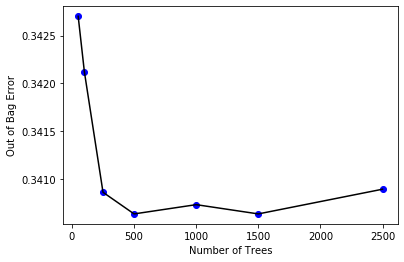


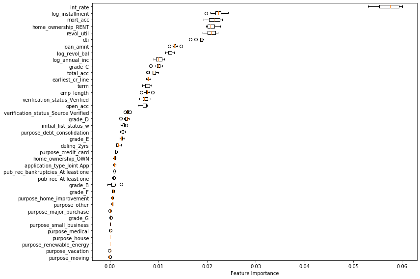


```python
# manually picked
important_indices = ['log_annual_inc',
                     'dti',
                     'home_ownership_OWN',
                     'home_ownership_RENT',
                     'log_installment',
                     'int_rate',
                     'loan_amnt',
                     'revol_util',
                     'grade_B',
                     'grade_C',
                     'grade_D',
                     'grade_E',
                     'grade_F',
                     'grade_G',
                     'term',
                     'verification_status_Source Verified',
                     'verification_status_Verified']
# important_indices = ['int_rate', 
#                      'revol_util',
#                      'dti',
#                      'log_installment', 
#                      'loan_amnt', 
#                      'mort_acc', 
#                      'home_ownership_RENT',
#                      'log_revol_bal']
x_train_rf = x_train.loc[:, important_indices]
x_test_rf = x_test.loc[:, important_indices]
```

#### Base Model


```python
model_rf_base_path = Path('../data/model_rf_base.joblib')
if os.path.exists(model_rf_base_path):
    model_rf_base = load(model_rf_base_path)
else:
    model_rf_base = RandomForestClassifier(n_estimators=500,
                                        min_samples_leaf=30,
                                        oob_score=True,
                                        random_state=100,
                                        n_jobs=-1)
    model_rf_base.fit(x_train_rf, y_train.values.ravel())
    dump(model_rf_base, model_rf_base_path)
```

#### Class Sensetive Method


```python
model_rf_path = Path('../data/model_rf.joblib')
if os.path.exists(model_rf_path):
    model_rf = load(model_rf_path)
else:
    model_rf = RandomForestClassifier(n_estimators=500,
                                        min_samples_leaf=30,
                                        oob_score=True,
                                        random_state=100,
                                        class_weight='balanced',
                                        n_jobs=-1)
    model_rf.fit(x_train_rf, y_train.values.ravel())
    dump(model_rf, model_rf_path)
```

#### Sampling - SMOTE Method


```python
model_rf_smote_path = Path('../data/model_rf_smote.joblib')
if os.path.exists(model_rf_smote_path):
    model_rf_smote = load(model_rf_smote_path)
else:
    x_train_rf_sm, y_train_sm = SMOTE(random_state=1).fit_resample(x_train_rf, y_train.values.ravel())
    model_rf_smote = RandomForestClassifier(n_estimators=500,
                                        min_samples_leaf=30,
                                        oob_score=True,
                                        random_state=100,
                                        n_jobs=-1)
    model_rf_smote.fit(x_train_rf_sm, y_train_sm)
    dump(model_rf_smote, model_rf_smote_path)
```

#### Sampling - ADASYN Method


```python
model_rf_adasyn_path = Path('../data/model_rf_adasyn.joblib')
if os.path.exists(model_rf_adasyn_path):
    model_rf_adasyn = load(model_rf_adasyn_path)
else:
    x_train_rf_as, y_train_as = ADASYN(random_state=1).fit_sample(x_train_rf, y_train.values.ravel())
    model_rf_adasyn = RandomForestClassifier(n_estimators=500,
                                        min_samples_leaf=30,
                                        oob_score=True,
                                        random_state=100,
                                        n_jobs=-1)
    model_rf_adasyn.fit(x_train_rf_as, y_train_as)
    dump(model_rf_adasyn, model_rf_adasyn_path)
```

### Random Forest Results


```python
# Make predictions and determine the error
y_pred_rf = model_rf_base.predict(x_test_rf)
print("Accuracy: %.2f%%" % (model_rf_base.score(x_test_rf, y_test) * 100))
print(confusion_matrix(y_test, y_pred_rf))
print('F1 Score:', f1_score(y_test, y_pred_rf))
print(classification_report(y_test, y_pred_rf))
# predict probabilities
prob = model_rf_base.predict_proba(x_test_rf)
# keep probabilities for the positive outcome only
preds = prob[:,1]
# calculate pr curve
precision_rf, recall_rf, threshold = precision_recall_curve(y_test, preds)
# calculate auc, equivalent to roc_auc_score()?
print('PR-AUC: ', auc(recall_rf, precision_rf))
```

    Accuracy: 67.73%
    [[6816 1413]
     [2863 2159]]
    F1 Score: 0.502443565278101
                  precision    recall  f1-score   support
    
               0       0.70      0.83      0.76      8229
               1       0.60      0.43      0.50      5022
    
        accuracy                           0.68     13251
       macro avg       0.65      0.63      0.63     13251
    weighted avg       0.67      0.68      0.66     13251
    
    PR-AUC:  0.593429439597816
    

#### Cost Sensitive Methods


```python
# Make predictions and determine the error
y_pred_rf = model_rf.predict(x_test_rf)
print("Accuracy: %.2f%%" % (model_rf.score(x_test_rf, y_test) * 100))
print(confusion_matrix(y_test, y_pred_rf))
print('F1 Score:', f1_score(y_test, y_pred_rf))
print(classification_report(y_test, y_pred_rf))
# predict probabilities
prob = model_rf.predict_proba(x_test_rf)
# keep probabilities for the positive outcome only
preds = prob[:,1]
# calculate pr curve
precision_rf, recall_rf, threshold = precision_recall_curve(y_test, preds)
# calculate auc, equivalent to roc_auc_score()?
print('PR-AUC: ', auc(recall_rf, precision_rf))
```

    Accuracy: 65.67%
    [[5234 2995]
     [1554 3468]]
    F1 Score: 0.6039181541140619
                  precision    recall  f1-score   support
    
               0       0.77      0.64      0.70      8229
               1       0.54      0.69      0.60      5022
    
        accuracy                           0.66     13251
       macro avg       0.65      0.66      0.65     13251
    weighted avg       0.68      0.66      0.66     13251
    
    PR-AUC:  0.5934318794159843
    

#### Sampling Methods - SMOTE


```python
y_pred_rf = model_rf_smote.predict(x_test_rf)
print("Accuracy: %.2f%%" % (model_rf_smote.score(x_test_rf, y_test) * 100))
print(confusion_matrix(y_test, y_pred_rf))
print('F1 Score:', f1_score(y_test, y_pred_rf))
print(classification_report(y_test, y_pred_rf))
# predict probabilities
prob = model_rf_smote.predict_proba(x_test_rf)
# keep probabilities for the positive outcome only
preds = prob[:,1]
# calculate pr curve
precision_rf, recall_rf, threshold = precision_recall_curve(y_test, preds)
# calculate auc, equivalent to roc_auc_score()?
print('PR-AUC: ', auc(recall_rf, precision_rf))
```

    Accuracy: 67.99%
    [[6404 1825]
     [2416 2606]]
    F1 Score: 0.5513593568179413
                  precision    recall  f1-score   support
    
               0       0.73      0.78      0.75      8229
               1       0.59      0.52      0.55      5022
    
        accuracy                           0.68     13251
       macro avg       0.66      0.65      0.65     13251
    weighted avg       0.67      0.68      0.68     13251
    
    PR-AUC:  0.5930660640408101
    

#### Sampling Methods - ADASYN


```python
y_pred_rf = model_rf_adasyn.predict(x_test_rf)
print("Accuracy: %.2f%%" % (model_rf_adasyn.score(x_test_rf, y_test) * 100))
print(confusion_matrix(y_test, y_pred_rf))
print('F1 Score:', f1_score(y_test, y_pred_rf))
print(classification_report(y_test, y_pred_rf))
# predict probabilities
prob = model_rf_adasyn.predict_proba(x_test_rf)
# keep probabilities for the positive outcome only
preds = prob[:,1]
# calculate pr curve
precision_rf, recall_rf, threshold = precision_recall_curve(y_test, preds)
# calculate auc, equivalent to roc_auc_score()?
print('PR-AUC: ', auc(recall_rf, precision_rf))
```

    Accuracy: 68.01%
    [[6401 1828]
     [2411 2611]]
    F1 Score: 0.5519501109819258
                  precision    recall  f1-score   support
    
               0       0.73      0.78      0.75      8229
               1       0.59      0.52      0.55      5022
    
        accuracy                           0.68     13251
       macro avg       0.66      0.65      0.65     13251
    weighted avg       0.67      0.68      0.68     13251
    
    PR-AUC:  0.5929695058205939
    

if you got an AUROC of 0.47, it just means you need to invert the predictions because Scikit-Learn is misinterpreting the positive class. AUROC should be >= 0.5.

### Neural Network Model


```python
# manual pick features kinda of improves nn but fully paid drops hard
scaler = StandardScaler()
scaler.fit(x_train.astype('float64'))
StandardScaler(copy=True, with_mean=True, with_std=True)
x_train_nn = scaler.transform(x_train.astype('float64'))
x_test_nn = scaler.transform(x_test.astype('float64'))
dump(scaler, Path('../data/scaler.joblib'))
```


    ['..\\data\\scaler.joblib']


#### Base


```python
model_nn_base = Sequential()
# Input layer
model_nn_base.add(Dense(20, activation='relu', input_shape=(39,)))
# Hidden layer
model_nn_base.add(Dense(15, activation='relu'))
model_nn_base.add(Dense(4, activation='relu'))
# Output layer
model_nn_base.add(Dense(2, activation='sigmoid'))
model_nn_base.output_shape

model_nn_base.compile(loss='binary_crossentropy',
                optimizer='adam',
                metrics=['accuracy'])
model_nn_base.fit(x_train_nn, to_categorical(y_train), epochs=5, batch_size=10, verbose=1)
```

    WARNING:tensorflow:From c:\users\leon\miniconda3\envs\aiml\lib\site-packages\tensorflow\python\framework\op_def_library.py:263: colocate_with (from tensorflow.python.framework.ops) is deprecated and will be removed in a future version.
    Instructions for updating:
    Colocations handled automatically by placer.
    WARNING:tensorflow:From c:\users\leon\miniconda3\envs\aiml\lib\site-packages\tensorflow\python\ops\math_ops.py:3066: to_int32 (from tensorflow.python.ops.math_ops) is deprecated and will be removed in a future version.
    Instructions for updating:
    Use tf.cast instead.
    Epoch 1/5
    30916/30916 [==============================] - 8s 267us/step - loss: 0.6057 - acc: 0.6652
    Epoch 2/5
    30916/30916 [==============================] - 7s 221us/step - loss: 0.5912 - acc: 0.6767
    Epoch 3/5
    30916/30916 [==============================] - 7s 217us/step - loss: 0.5880 - acc: 0.6805
    Epoch 4/5
    30916/30916 [==============================] - 7s 218us/step - loss: 0.5862 - acc: 0.6815
    Epoch 5/5
    30916/30916 [==============================] - 7s 218us/step - loss: 0.5842 - acc: 0.6830
    


    <keras.callbacks.History at 0x1dc8a0d5470>


#### Cost Sensentive Method


```python
model_nn_path = Path('../data/model_nn.h5')
if os.path.exists(model_nn_path):
    model_nn = load_model(str(model_nn_path))
else:
    class_weights = class_weight.compute_class_weight('balanced', 
                                                  np.unique(y_train.values.ravel()), 
                                                  y_train.values.ravel())
    model_nn = Sequential()
    # Input layer
    model_nn.add(Dense(20, activation='relu', input_shape=(39,)))
    # Hidden layer
    model_nn.add(Dense(15, activation='relu'))
    model_nn.add(Dense(4, activation='relu'))
    # Output layer
    model_nn.add(Dense(2, activation='sigmoid'))
    model_nn.output_shape
    
    model_nn.compile(loss='binary_crossentropy',
                    optimizer='adam',
                    metrics=['accuracy'])
    model_nn.fit(x_train_nn, to_categorical(y_train), epochs=5, batch_size=10, class_weight=class_weights, verbose=1)
    
    model_nn.save(str(model_nn_path))
print(model_nn.summary())
```

    Epoch 1/5
    30916/30916 [==============================] - 8s 269us/step - loss: 0.6054 - acc: 0.6607
    Epoch 2/5
    30916/30916 [==============================] - 7s 222us/step - loss: 0.5908 - acc: 0.6779
    Epoch 3/5
    30916/30916 [==============================] - 7s 225us/step - loss: 0.5880 - acc: 0.6792
    Epoch 4/5
    30916/30916 [==============================] - 7s 221us/step - loss: 0.5860 - acc: 0.6822
    Epoch 5/5
    30916/30916 [==============================] - 7s 223us/step - loss: 0.5844 - acc: 0.6843
    _________________________________________________________________
    Layer (type)                 Output Shape              Param #   
    =================================================================
    dense_5 (Dense)              (None, 20)                800       
    _________________________________________________________________
    dense_6 (Dense)              (None, 15)                315       
    _________________________________________________________________
    dense_7 (Dense)              (None, 4)                 64        
    _________________________________________________________________
    dense_8 (Dense)              (None, 2)                 10        
    =================================================================
    Total params: 1,189
    Trainable params: 1,189
    Non-trainable params: 0
    _________________________________________________________________
    None
    

#### Sampling Method - SMOTE


```python
if os.path.exists(Path('../data/model_nn_smote.h5')):
    model_nn_smote = load_model(str(Path('../data/model_nn_smote.h5')))
else:
    x_train_nn_sm, y_train_sm = SMOTE(random_state=1).fit_sample(x_train_nn, y_train.values.ravel())
    model_nn_smote = load_model(str(model_nn_path))
    model_nn_smote.fit(x_train_nn_sm, to_categorical(y_train_sm), epochs=5, batch_size=10, verbose=0)
    model_nn_smote.save(str(Path('../data/model_nn_smote.h5')))
```

#### Sampling Method - ADASYN


```python
if os.path.exists(Path('../data/model_nn_adasyn.h5')):
    model_nn_adasyn = load_model(str(Path('../data/model_nn_adasyn.h5')))
else:
    x_train_nn_as, y_train_as = ADASYN(random_state=1).fit_sample(x_train_nn, y_train.values.ravel())
    model_nn_adasyn = load_model(str(model_nn_path))
    model_nn_adasyn.fit(x_train_nn_as, to_categorical(y_train_as), epochs=5, batch_size=10, verbose=0)
    model_nn_adasyn.save(str(Path('../data/model_nn_adasyn.h5')))
```

### Neural Network Results

#### Base


```python
y_pred_nn = model_nn_base.predict_classes(x_test_nn)
score = model_nn_base.evaluate(x_test_nn, to_categorical(y_test))
print("Accuracy: %.2f%%" % (score[1]*100))
print(confusion_matrix(y_test, y_pred_nn))
print('F1 Score:', f1_score(y_test, y_pred_nn))
print(classification_report(y_test, y_pred_nn))
# predict probabilities
prob = model_nn_base.predict(x_test_nn)
# keep probabilities for the positive outcome only
preds = prob[:,1]
# calculate pr curve
precision_rf, recall_rf, threshold = precision_recall_curve(y_test, preds)
# calculate auc, equivalent to roc_auc_score()?
print('PR-AUC: ', auc(recall_rf, precision_rf))
```

    13251/13251 [==============================] - 1s 52us/step
    Accuracy: 67.16%
    [[7043 1186]
     [3164 1858]]
    F1 Score: 0.46069923134143315
                  precision    recall  f1-score   support
    
               0       0.69      0.86      0.76      8229
               1       0.61      0.37      0.46      5022
    
        accuracy                           0.67     13251
       macro avg       0.65      0.61      0.61     13251
    weighted avg       0.66      0.67      0.65     13251
    
    PR-AUC:  0.5744885194559898
    

#### Cost Sensentive Method


```python
y_pred_nn = model_nn.predict_classes(x_test_nn)
score = model_nn.evaluate(x_test_nn, to_categorical(y_test))
print("Accuracy: %.2f%%" % (score[1]*100))
print(confusion_matrix(y_test, y_pred_nn))

# df_cm = pd.DataFrame(confusion_matrix(y_test, y_pred_nn), 
#                       index = ['Fully Paid', 'Default'], 
#                       columns = ['Fully Paid', 'Default'])
# plt.figure(figsize = (10,7))
# sns.heatmap(df_cm, annot=True)
print('F1 Score:', f1_score(y_test, y_pred_nn))
print(classification_report(y_test, y_pred_nn))
# predict probabilities
prob = model_nn.predict(x_test_nn)
# keep probabilities for the positive outcome only
preds = prob[:,1]
# calculate pr curve
precision_rf, recall_rf, threshold = precision_recall_curve(y_test, preds)
# calculate auc, equivalent to roc_auc_score()?
print('PR-AUC: ', auc(recall_rf, precision_rf))
```

    13251/13251 [==============================] - 1s 45us/step
    Accuracy: 66.74%
    [[6915 1314]
     [3088 1934]]
    F1 Score: 0.46771463119709794
                  precision    recall  f1-score   support
    
               0       0.69      0.84      0.76      8229
               1       0.60      0.39      0.47      5022
    
        accuracy                           0.67     13251
       macro avg       0.64      0.61      0.61     13251
    weighted avg       0.65      0.67      0.65     13251
    
    PR-AUC:  0.5728758449378086
    

notes
higher f1 score is good.
we dont want a default to be labeled as a paid since this results in a larger loss of money
so we want to minimize false negative(label was predicted positive and is actually negative or predicted paid actually default)
so we want to look at recall
loook at the numbers for 1

#### Sampling Method - SMOTE


```python
y_pred_nn = model_nn_smote.predict_classes(x_test_nn)
score = model_nn_smote.evaluate(x_test_nn, to_categorical(y_test))
print("Accuracy: %.2f%%" % (score[1]*100))
print(confusion_matrix(y_test, y_pred_nn))
print('F1 Score:', f1_score(y_test, y_pred_nn))
print(classification_report(y_test, y_pred_nn))
# predict probabilities
prob = model_nn_smote.predict(x_test_nn)
# keep probabilities for the positive outcome only
preds = prob[:,1]
# calculate pr curve
precision_rf, recall_rf, threshold = precision_recall_curve(y_test, preds)
# calculate auc, equivalent to roc_auc_score()?
print('PR-AUC: ', auc(recall_rf, precision_rf))
```

    13251/13251 [==============================] - 1s 49us/step
    Accuracy: 63.85%
    [[5065 3164]
     [1625 3397]]
    F1 Score: 0.5865492532159199
                  precision    recall  f1-score   support
    
               0       0.76      0.62      0.68      8229
               1       0.52      0.68      0.59      5022
    
        accuracy                           0.64     13251
       macro avg       0.64      0.65      0.63     13251
    weighted avg       0.67      0.64      0.64     13251
    
    PR-AUC:  0.5673667911654872
    

#### Sampling Method - ADASYN


```python
y_pred_nn = model_nn_adasyn.predict_classes(x_test_nn)
score = model_nn_adasyn.evaluate(x_test_nn, to_categorical(y_test))
print("Accuracy: %.2f%%" % (score[1]*100))
print(confusion_matrix(y_test, y_pred_nn))
print('F1 Score:', f1_score(y_test, y_pred_nn))
print(classification_report(y_test, y_pred_nn))
# predict probabilities
prob = model_nn_adasyn.predict(x_test_nn)
# keep probabilities for the positive outcome only
preds = prob[:,1]
# calculate pr curve
precision_rf, recall_rf, threshold = precision_recall_curve(y_test, preds)
# calculate auc, equivalent to roc_auc_score()?
print('PR-AUC: ', auc(recall_rf, precision_rf))
```

    13251/13251 [==============================] - 1s 45us/step
    Accuracy: 63.02%
    [[4790 3439]
     [1461 3561]]
    F1 Score: 0.5924139078356346
                  precision    recall  f1-score   support
    
               0       0.77      0.58      0.66      8229
               1       0.51      0.71      0.59      5022
    
        accuracy                           0.63     13251
       macro avg       0.64      0.65      0.63     13251
    weighted avg       0.67      0.63      0.64     13251
    
    PR-AUC:  0.5665364411060081
    

### XGBoost Model


```python
# TODO: wrap under a if condition for cost sensitive so this doesnt have to run everytime
model_xgb = XGBClassifier(max_depth=3,
                          learning_rate=0.05,
                          n_estimators=300,
                          objective='binary:logistic',
                          subsample=0.8,
                          random_state=42)
eval_set = [(x_train, y_train.values.ravel()), (x_test, y_test.values.ravel())]
eval_metric = ['auc', 'error']
model_xgb.fit(x_train, y_train.values.ravel(), eval_metric=eval_metric, eval_set=eval_set, 
              verbose=False)
```


    XGBClassifier(base_score=0.5, booster='gbtree', colsample_bylevel=1,
                  colsample_bynode=1, colsample_bytree=1, gamma=0,
                  learning_rate=0.05, max_delta_step=0, max_depth=3,
                  min_child_weight=1, missing=None, n_estimators=300, n_jobs=1,
                  nthread=None, objective='binary:logistic', random_state=42,
                  reg_alpha=0, reg_lambda=1, scale_pos_weight=1, seed=None,
                  silent=None, subsample=0.8, verbosity=1)


```python
results = model_xgb.evals_result()
epochs = len(results['validation_0']['error'])
x_axis = range(0, epochs)

f, (ax1, ax2) = plt.subplots(nrows=1, ncols=2, figsize=(12, 3), dpi=90)
ax1.plot(x_axis, results['validation_0']['auc'], label='Train')
ax1.plot(x_axis, results['validation_1']['auc'], label='Test')
ax1.legend()
ax1.set_ylabel('AUC')
ax1.set_title('XGBoost PR-AUC')

ax2.plot(x_axis, results['validation_0']['error'], label='Train')
ax2.plot(x_axis, results['validation_1']['error'], label='Test')
ax2.legend()
ax2.set_ylabel('Classification Error')
ax2.set_title('XGBoost Classifcation Error')
plt.show()

plot_importance(model_xgb)
plt.show()
```


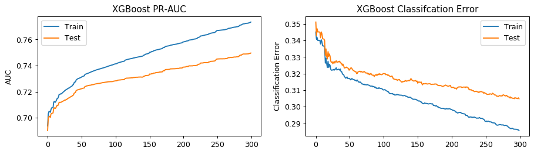


```python
# from sklearn.feature_selection import SelectFromModel
# from sklearn.metrics import accuracy_score
# thresholds = np.sort(model_xgb.feature_importances_)
# for thresh in thresholds:
#     # select features using threshold
#     selection = SelectFromModel(model_xgb, threshold=thresh, prefit=True)
#     select_x_train = selection.transform(x_train)
#     # train model
#     selection_model = XGBClassifier(scale_pos_weight=class_weights[1])
#     selection_model.fit(select_x_train, y_train.values.ravel())
#     # eval model
#     select_x_test = selection.transform(x_test)
#     y_pred_xgb = selection_model.predict(select_x_test)
#     predictions = [round(value) for value in y_pred_xgb]
#     accuracy = accuracy_score(y_test, predictions)
#     print("Thresh=%.3f, n=%d, Accuracy: %.2f%%" % (thresh, 
#                                                   select_x_train.shape[1], 
#                                                   accuracy * 100))
```


```python
# Extract the ten most important features

# manually picked somewhat improved xgboost cost sensitive by a small amount
important_indices = ['log_annual_inc',
                     'dti',
                     'home_ownership_OWN',
                     'home_ownership_RENT',
                     'log_installment',
                     'int_rate',
                     'loan_amnt',
                     'revol_util',
                     'grade_B',
                     'grade_C',
                     'grade_D',
                     'grade_E',
                     'grade_F',
                     'grade_G',
                     'term',
                     'verification_status_Source Verified',
                     'verification_status_Verified']
# important_indices = ['dti', 
#                      'int_rate',
#                      'revol_util',
#                      'log_installment', 
#                      'open_acc', 
#                      'log_revol_bal', 
#                      'mort_acc', 
#                      'loan_amnt', 
#                      'total_acc',
#                      'log_annual_inc']
x_train_xgb = x_train.loc[:, important_indices]
x_test_xgb = x_test.loc[:, important_indices]
```

#### Base Model


```python
model_xgb_base_path = Path('../data/model_xgb_base.joblib')
if os.path.exists(model_xgb_base_path):
    model_xgb_base = load(model_xgb_base_path)
else:
    model_xgb_base = XGBClassifier(max_depth=3,
                              learning_rate=0.05,
                              n_estimators=300,
                              objective='binary:logistic',
                              subsample=0.8,
                              random_state=42)
    model_xgb_base.fit(x_train_xgb, y_train.values.ravel())
    dump(model_xgb_base, model_xgb_base_path)
```

#### Cost Sensitive Method


```python
model_path_xgb = Path('../data/model_xgb.joblib')
if os.path.exists(model_path_xgb):
    model_xgb = load(model_path_xgb)
else:
    neg_weight = y_train['loan_status'].value_counts(dropna=False)[0]/y_train['loan_status'].value_counts(dropna=False)[1]
    model_xgb = XGBClassifier(max_depth=3,
                              learning_rate=0.05,
                              n_estimators=300,
                              objective='binary:logistic',
                              subsample=0.8,
                              scale_pos_weight=neg_weight, 
                              random_state=42)
    model_xgb.fit(x_train_xgb, y_train.values.ravel())
    dump(model_xgb, model_path_xgb)
```

#### Sampling Method - SMOTE


```python
model_xgb_smote_path = Path('../data/model_xgb_smote.joblib')
if os.path.exists(model_xgb_smote_path):
    model_xgb_smote = load(model_xgb_smote_path)
else:
    x_train_xgb_sm, y_train_sm = SMOTE(random_state=1).fit_resample(x_train_xgb, y_train.values.ravel())
    x_train_xgb_sm = pd.DataFrame(x_train_xgb_sm, columns=x_test_xgb.columns)
    y_train_sm = pd.DataFrame(y_train_sm, columns=y_train.columns)
    model_xgb_smote = XGBClassifier(max_depth=3,
                          learning_rate=0.01,
                          n_estimators=300,
                          objective='binary:logistic',
                          subsample=0.8,
                          random_state=42)
    model_xgb_smote.fit(x_train_xgb_sm, y_train_sm.values.ravel())
    dump(model_xgb_smote, model_xgb_smote_path)
```


```python
# eval_set = [(x_train_xgb_sm, y_train_sm.values.ravel()), (x_test_xgb, y_test.values.ravel())]
# eval_metric = ['auc', 'error']
# model_xgb_smote.fit(x_train_xgb_sm, y_train_sm.values.ravel(), eval_metric=eval_metric, eval_set=eval_set, 
#               verbose=False)

# results = model_xgb_smote.evals_result()
# epochs = len(results['validation_0']['error'])
# x_axis = range(0, epochs)

# f, (ax1, ax2) = plt.subplots(nrows=1, ncols=2, figsize=(12, 3), dpi=90)
# ax1.plot(x_axis, results['validation_0']['auc'], label='Train')
# ax1.plot(x_axis, results['validation_1']['auc'], label='Test')
# ax1.legend()
# ax1.set_ylabel('AUC')
# ax1.set_title('XGBoost AUC')

# ax2.plot(x_axis, results['validation_0']['error'], label='Train')
# ax2.plot(x_axis, results['validation_1']['error'], label='Test')
# ax2.legend()
# ax2.set_ylabel('Classification Error')
# ax2.set_title('XGBoost Classifcation Error')
# plt.show()

# plot_importance(model_xgb_smote)
# plt.show()
```

#### Sampling Method - ADASYN


```python
model_xgb_adasyn_path = Path('../data/model_xgb_adasyn.joblib')
if os.path.exists(model_xgb_adasyn_path):
    model_xgb_adasyn = load(model_xgb_adasyn_path)
else:
    x_train_xgb_as, y_train_as = ADASYN(random_state=1).fit_sample(x_train_xgb, y_train.values.ravel())
    x_train_xgb_as = pd.DataFrame(x_train_xgb_as, columns=x_test_xgb.columns)
    y_train_as = pd.DataFrame(y_train_as, columns=y_train.columns)
    model_xgb_adasyn = XGBClassifier(max_depth=3,
                          learning_rate=0.01,
                          n_estimators=300,
                          objective='binary:logistic',
                          subsample=0.8,
                          random_state=42)
    model_xgb_adasyn.fit(x_train_xgb_as, y_train_as.values.ravel())
    dump(model_xgb_adasyn, model_xgb_adasyn_path)
```

### XGBoost Results


```python
# Make predictions and determine the error
y_pred_xgb = model_xgb_base.predict(x_test_xgb)
print("Accuracy: %.2f%%" % (model_xgb_base.score(x_test_xgb, y_test) * 100))
print(confusion_matrix(y_test, y_pred_xgb))
print('F1 Score:', f1_score(y_test, y_pred_xgb))
print(classification_report(y_test, y_pred_xgb))
# predict probabilities
prob = model_xgb_base.predict_proba(x_test_xgb)
# keep probabilities for the positive outcome only
preds = prob[:,1]
# calculate pr curve
precision_xgb, recall_xgb, threshold = precision_recall_curve(y_test, preds)
# calculate auc, equivalent to roc_auc_score()?
print('PR-AUC: ', auc(recall_xgb, precision_xgb))
```

    Accuracy: 69.51%
    [[6757 1472]
     [2568 2454]]
    F1 Score: 0.5485024586499776
                  precision    recall  f1-score   support
    
               0       0.72      0.82      0.77      8229
               1       0.63      0.49      0.55      5022
    
        accuracy                           0.70     13251
       macro avg       0.67      0.65      0.66     13251
    weighted avg       0.69      0.70      0.69     13251
    
    PR-AUC:  0.6219669164829286
    

#### Cost Sensitive Method


```python
# Make predictions and determine the error
y_pred_xgb = model_xgb.predict(x_test_xgb)
print("Accuracy: %.2f%%" % (model_xgb.score(x_test_xgb, y_test) * 100))
print(confusion_matrix(y_test, y_pred_xgb))
print('F1 Score:', f1_score(y_test, y_pred_xgb))
print(classification_report(y_test, y_pred_xgb))
# predict probabilities
prob = model_xgb.predict_proba(x_test_xgb)
# keep probabilities for the positive outcome only
preds = prob[:,1]
# calculate pr curve
precision_xgb, recall_xgb, threshold = precision_recall_curve(y_test, preds)
# calculate auc, equivalent to roc_auc_score()?
print('PR-AUC: ', auc(recall_xgb, precision_xgb))
```

    Accuracy: 67.63%
    [[5281 2948]
     [1342 3680]]
    F1 Score: 0.6317596566523604
                  precision    recall  f1-score   support
    
               0       0.80      0.64      0.71      8229
               1       0.56      0.73      0.63      5022
    
        accuracy                           0.68     13251
       macro avg       0.68      0.69      0.67     13251
    weighted avg       0.71      0.68      0.68     13251
    
    PR-AUC:  0.621457929718918
    

#### Sampling Method - SMOTE


```python
y_pred_xgb = model_xgb_smote.predict(x_test_xgb)
print("Accuracy: %.2f%%" % (model_xgb_smote.score(x_test_xgb, y_test) * 100))
print(confusion_matrix(y_test, y_pred_xgb))
print('F1 Score:', f1_score(y_test, y_pred_xgb))
print(classification_report(y_test, y_pred_xgb))
# predict probabilities
prob = model_xgb_smote.predict_proba(x_test_xgb)
# keep probabilities for the positive outcome only
preds = prob[:,1]
# calculate pr curve
precision_xgb, recall_xgb, threshold = precision_recall_curve(y_test, preds)
# calculate auc, equivalent to roc_auc_score()?
print('PR-AUC: ', auc(recall_xgb, precision_xgb))
```

    Accuracy: 66.77%
    [[6013 2216]
     [2187 2835]]
    F1 Score: 0.5628908964558722
                  precision    recall  f1-score   support
    
               0       0.73      0.73      0.73      8229
               1       0.56      0.56      0.56      5022
    
        accuracy                           0.67     13251
       macro avg       0.65      0.65      0.65     13251
    weighted avg       0.67      0.67      0.67     13251
    
    PR-AUC:  0.5839595093688296
    

#### Sampling Method - ADASYN


```python
y_pred_xgb = model_xgb_adasyn.predict(x_test_xgb)
print("Accuracy: %.2f%%" % (model_xgb_adasyn.score(x_test_xgb, y_test) * 100))
print(confusion_matrix(y_test, y_pred_xgb))
print('F1 Score:', f1_score(y_test, y_pred_xgb))
print(classification_report(y_test, y_pred_xgb))
# predict probabilities
prob = model_xgb_adasyn.predict_proba(x_test_xgb)
# keep probabilities for the positive outcome only
preds = prob[:,1]
# calculate pr curve
precision_xgb, recall_xgb, threshold = precision_recall_curve(y_test, preds)
# calculate auc, equivalent to roc_auc_score()?
print('PR-AUC: ', auc(recall_xgb, precision_xgb))
```

    Accuracy: 66.83%
    [[6014 2215]
     [2180 2842]]
    F1 Score: 0.5639448357972022
                  precision    recall  f1-score   support
    
               0       0.73      0.73      0.73      8229
               1       0.56      0.57      0.56      5022
    
        accuracy                           0.67     13251
       macro avg       0.65      0.65      0.65     13251
    weighted avg       0.67      0.67      0.67     13251
    
    PR-AUC:  0.584599657530125
    

### Support Vector Machine Model


```python
# from sklearn.svm import SVC
# from sklearn.model_selection import GridSearchCV

# model_svm_path = Path('../data/model_svm.joblib')
# if os.path.exists(model_svm_path):
#     model_svm = load(model_svm_path)
# else:            
#     # parameter_candidates = [
#     #     {'C': [1, 10, 100], 'kernel': ['linear'], 'class_weight': ['balanced']},        
#     #     {'C': [1, 10, 100], 'gamma': [10, 0, 0.001, 0.0001], 'kernel': ['rbf'], 'class_weight': ['balanced']}    
#     # ]
#     # 
#     # clf = GridSearchCV(estimator=SVC(), param_grid = parameter_candidates, n_jobs=-1, cv=5)
#     # clf.fit(x_train, y_train.values.ravel())
#     # print('Best score for data:', clf.best_score_)
#     # print('Best C:', clf.best_estimator_.C)
#     # print('Best Kernel:', clf.best_estimator_.kernel)
#     # print('Best Gamma:', clf.best_estimator_.gamma)
#     model_svm = SVC(kernel='rbf', C=1, gamma=0.05, class_weight='balanced', random_state=0)
#     model_svm.fit(x_train, y_train.values.ravel())
#     dump(model_svm, model_svm_path)
# y_pred_svm = model_svm.predict(x_test)
# print('Accuracy of SVM on test set: {:.3f}'.format(model_svm.score(x_test, y_test)))
# # 0.741 C=1 gamma = 0.05
# # 0.777 C=1 gamma = 1
```


```python
# print("Accuracy: %.2f%%" % (model_svm.score(x_test, y_test) * 100))
# print(confusion_matrix(y_test, y_pred_svm))
```

### Ensembled Model


```python
# Random Forest Model
output_rf = model_rf.predict_proba(x_test_rf)
output_rf2 = model_rf.predict(x_test_rf)

# Neural Network Model
output_nn = model_nn_adasyn.predict(x_test_nn)
output_nn2 = model_nn_adasyn.predict_classes(x_test_nn)

# XGBoost Model
output_xgb = model_xgb.predict_proba(x_test_xgb)
output_xgb2 = model_xgb.predict(x_test_xgb)

# Ensemble output
# Avg
output = (output_rf + output_nn + output_xgb) / 3

# Majority vote
output2 = pd.DataFrame({'rf': output_rf2, 'nn': output_nn2, 'xgb': output_xgb2})
output2['Prediction'] = output2.sum(axis=1)
output2.loc[output2['Prediction'] < 2, 'Prediction'] = 0
output2.loc[output2['Prediction'] >= 2, 'Prediction'] = 1
```

#### Stacking


```python
# Obtain the base first-level model predictions
y_pred_stacking_rf = model_rf.predict(x_train_rf)
y_pred_stacking_nn = model_nn_adasyn.predict_classes(x_train_nn)
y_pred_stacking_xgb = model_xgb.predict(x_train_xgb)
x_train_stacking = pd.DataFrame({'rf': y_pred_stacking_rf, 'nn': y_pred_stacking_nn, 'xgb': y_pred_stacking_xgb})
y_train_stacking = pd.DataFrame(y_train.copy())
x_test_stacking = pd.DataFrame({'rf': output_rf2, 'nn': output_nn2, 'xgb': output_xgb2})
y_test_stacking = pd.DataFrame(y_test.copy())

# Fit the Meta Learner from first level predictions
# arthurtok introduction to ensembling stacking in python
# test to see if i need to smote this shit again
neg_weight = y_train_stacking['loan_status'].value_counts(dropna=False)[0]/y_train_stacking['loan_status'].value_counts(dropna=False)[1]
model_stacking_xgb = XGBClassifier(max_depth=3, 
                                   learning_rate=0.05, 
                                   n_estimators=300, 
                                   objective='binary:logistic', 
                                   subsample=0.8, 
                                   scale_pos_weight=neg_weight, 
                                   random_state=42)
model_stacking_xgb.fit(x_train_stacking, y_train_stacking.values.ravel())

model_stacking_lr = LogisticRegression(penalty="l2", C=0.5, fit_intercept=True, class_weight='balanced',
                               random_state=0, max_iter=10000, solver='lbfgs')
model_stacking_lr.fit(x_train_stacking, y_train_stacking.values.ravel())
```


    LogisticRegression(C=0.5, class_weight='balanced', dual=False,
                       fit_intercept=True, intercept_scaling=1, l1_ratio=None,
                       max_iter=10000, multi_class='auto', n_jobs=None,
                       penalty='l2', random_state=0, solver='lbfgs', tol=0.0001,
                       verbose=0, warm_start=False)


### Ensembled Results


```python
p_output = pd.DataFrame(output.copy())
p_output.columns = ['Fully Paid', 'Default']
p_output['Prediction'] = p_output.idxmax(axis=1)
p_output['Fully Paid'] = p_output['Fully Paid'].multiply(100).round(0).astype(int).astype(str) + '%'
p_output['Default'] = p_output['Default'].multiply(100).round(0).astype(int).astype(str) + '%'

y_test2 = pd.DataFrame(y_test.copy())
y_test2.columns = ['Prediction']
y_test2['Prediction'].replace(0, 'Fully Paid', inplace=True)
y_test2['Prediction'].replace(1, 'Default', inplace=True)
print('Averaging Method')
accuracy = accuracy_score(y_true=y_test2, y_pred=p_output['Prediction'])
print("Accuracy: %.2f%%" % (accuracy * 100))
print(confusion_matrix(y_test2, p_output['Prediction']))
print(classification_report(y_test2, p_output['Prediction']))

# Majority
output2['Prediction'].replace(0, 'Fully Paid', inplace=True)
output2['Prediction'].replace(1, 'Default', inplace=True)

print('\nMajority Method')
accuracy = accuracy_score(y_true=y_test2, y_pred=output2['Prediction'])
print("Accuracy: %.2f%%" % (accuracy * 100))
print(confusion_matrix(y_test2, output2['Prediction']))
print(classification_report(y_test2, output2['Prediction']))
```

    Averaging Method
    Accuracy: 66.66%
    [[3576 1446]
     [2972 5257]]
                  precision    recall  f1-score   support
    
         Default       0.55      0.71      0.62      5022
      Fully Paid       0.78      0.64      0.70      8229
    
        accuracy                           0.67     13251
       macro avg       0.67      0.68      0.66     13251
    weighted avg       0.69      0.67      0.67     13251
    
    
    Majority Method
    Accuracy: 66.64%
    [[3606 1416]
     [3004 5225]]
                  precision    recall  f1-score   support
    
         Default       0.55      0.72      0.62      5022
      Fully Paid       0.79      0.63      0.70      8229
    
        accuracy                           0.67     13251
       macro avg       0.67      0.68      0.66     13251
    weighted avg       0.70      0.67      0.67     13251
    
    


```python
# Predict the test
y_pred_xgb = model_stacking_xgb.predict(x_test_stacking)
print("Accuracy: %.2f%%" % (model_stacking_xgb.score(x_test_stacking, y_test_stacking) * 100))
print(confusion_matrix(y_test_stacking, y_pred_xgb))
print('F1 Score:', f1_score(y_test_stacking, y_pred_xgb))
print(classification_report(y_test_stacking, y_pred_xgb))
# predict probabilities
prob = model_stacking_xgb.predict_proba(x_test_stacking)
# keep probabilities for the positive outcome only
preds = prob[:,1]
# calculate pr curve
precision_xgb, recall_xgb, threshold = precision_recall_curve(y_test_stacking, preds)
# calculate auc, equivalent to roc_auc_score()?
print('PR-AUC: ', auc(recall_xgb, precision_xgb))
```

    Accuracy: 65.67%
    [[5234 2995]
     [1554 3468]]
    F1 Score: 0.6039181541140619
                  precision    recall  f1-score   support
    
               0       0.77      0.64      0.70      8229
               1       0.54      0.69      0.60      5022
    
        accuracy                           0.66     13251
       macro avg       0.65      0.66      0.65     13251
    weighted avg       0.68      0.66      0.66     13251
    
    PR-AUC:  0.6696112083428931
    


```python
y_pred_lr = model_stacking_lr.predict(x_test_stacking)
print("Accuracy: %.2f%%" % (model_stacking_lr.score(x_test_stacking, y_test_stacking) * 100))
print(confusion_matrix(y_test_stacking, y_pred_lr))
print('F1 Score:', f1_score(y_test_stacking, y_pred_lr))
print(classification_report(y_test_stacking, y_pred_lr))
# predict probabilities
prob = model_stacking_lr.predict_proba(x_test_stacking)
# keep probabilities for the positive outcome only
preds = prob[:,1]
# calculate pr curve
precision_lr, recall_lr, threshold = precision_recall_curve(y_test_stacking, preds)
# calculate auc, equivalent to roc_auc_score()?
print('PR-AUC: ', auc(recall_lr, precision_lr))
```

    Accuracy: 66.52%
    [[5388 2841]
     [1595 3427]]
    F1 Score: 0.6070859167404783
                  precision    recall  f1-score   support
    
               0       0.77      0.65      0.71      8229
               1       0.55      0.68      0.61      5022
    
        accuracy                           0.67     13251
       macro avg       0.66      0.67      0.66     13251
    weighted avg       0.69      0.67      0.67     13251
    
    PR-AUC:  0.6683310271522053
    


```python
# predict probabilities
model_rf = load(model_rf_path)
model_nn = load_model(str(Path('../data/model_nn_adasyn.h5')))
model_xgb = load(model_path_xgb)
pos_pred_rf = model_rf.predict_proba(x_test_rf)
pos_pred_nn = model_nn.predict(x_test_nn)
pos_pred_xgb = model_xgb.predict_proba(x_test_xgb)
# keep probabilities for the positive outcome only
pos_pred_rf = pos_pred_rf[:,1]
pos_pred_nn = pos_pred_nn[:,1]
pos_pred_xgb = pos_pred_xgb[:,1]
# calculate roc curve
fpr_rf, tpr_rf, threshold = roc_curve(y_test, pos_pred_rf)
fpr_nn, tpr_nn, threshold = roc_curve(y_test, pos_pred_nn)
fpr_xgb, tpr_xgb, threshold = roc_curve(y_test, pos_pred_xgb)
# # calculate auc, equivalent to roc_auc_score()?
roc_auc_rf = auc(fpr_rf, tpr_rf)
roc_auc_nn = auc(fpr_nn, tpr_nn)
roc_auc_xgb = auc(fpr_xgb, tpr_xgb)

f, (ax1, ax2) = plt.subplots(nrows=1, ncols=2, figsize=(12, 3), dpi=90)
ax1.set_title('Receiver Operating Characteristic')
ax1.plot(fpr_rf, tpr_rf, 'r', label = 'RF AUC = %0.2f' % roc_auc_rf)
ax1.plot(fpr_nn, tpr_nn, 'b', label = 'NN AUC = %0.2f' % roc_auc_nn)
ax1.plot(fpr_xgb, tpr_xgb, color='yellow', label = 'XGB AUC = %0.2f' % roc_auc_xgb)
ax1.legend(loc = 'lower right')
ax1.plot([0, 1], [0, 1], 'g--')
ax1.set_ylabel('True Positive Rate')
ax1.set_xlabel('False Positie Rate')

precision_rf, recall_rf, threshold = precision_recall_curve(y_test, pos_pred_rf)
precision_nn, recall_nn, threshold = precision_recall_curve(y_test, pos_pred_nn)
precision_xgb, recall_xgb, threshold = precision_recall_curve(y_test, pos_pred_xgb)
pr_auc_rf = auc(recall_rf, precision_rf)
pr_auc_nn = auc(recall_nn, precision_nn)
pr_auc_xgb = auc(recall_xgb, precision_xgb)
ax2.set_title('Precision-Recall Curve')
ax2.plot(recall_rf, precision_rf, 'r', label = 'RF AUC = %0.2f' % pr_auc_rf)
ax2.plot(recall_nn, precision_nn, 'b', label = 'NN AUC = %0.2f' % pr_auc_nn)
ax2.plot(recall_xgb, precision_xgb, 'y', label = 'XGB AUC = %0.2f' % pr_auc_xgb)
ax2.legend(loc = 'upper right')
ax2.plot([0, 1], [0.4, 0.4], 'r--')
ax2.set_ylabel('Precision')
ax2.set_xlabel('Recall')
plt.show()
```


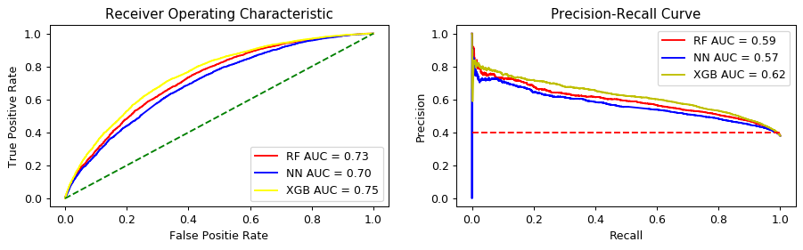


```python
accu_metrics = pd.DataFrame(p_output.copy())
accu_metrics['Actual'] = y_test2.to_numpy()
accu_metrics['category'] = accu_metrics[['Fully Paid', 'Default']].max(axis=1)
accu_metrics['category'] = accu_metrics['category'].str.rstrip('%').astype('float')
temp = pd.DataFrame(x_test['loan_amnt'])
temp = temp.join(test_pymnts)
temp.reset_index(inplace=True, drop=True)
accu_metrics = accu_metrics.join(temp)
accu_metrics['PL'] = ((accu_metrics['total_pymnt'] - accu_metrics['loan_amnt']) / abs(accu_metrics['loan_amnt'])) * 100
accu_metrics['proba_range'] = pd.cut(accu_metrics['category'], [0, 10, 20, 30, 40, 50, 60, 70, 80, 90, 100], right=False,
                           labels=['0-10', '10-20', '20-30', '30-40', '40-50', '50-60', 
                                   '60-70', '70-80', '80-90', '90-100'], include_lowest=True)
accu_metrics['correct'] = 0
accu_metrics.loc[accu_metrics['Prediction'] == accu_metrics['Actual'], 'correct'] = 1
accu_metric = pd.DataFrame(accu_metrics.groupby('proba_range')['correct'].sum())
accu_metric['total'] = accu_metrics.groupby(['proba_range']).count()['correct']
accu_metric['Accuracy'] = accu_metric['correct'] / accu_metric['total'] * 100
accu_metric.dropna(inplace=True)
accu_metric.reset_index(inplace=True)

returns_orgi = pd.DataFrame(accu_metrics.groupby('proba_range')['PL'].sum())
returns_orgi['rows'] = accu_metrics.groupby(['proba_range']).count()['correct']
returns_orgi['Avg_pct_return'] = returns_orgi['PL'] / returns_orgi['rows']
returns_new = accu_metrics.loc[accu_metrics['Prediction']=='Fully Paid']
returns_new = pd.DataFrame(returns_new.groupby('proba_range')['PL'].sum())
returns_new['rows'] = accu_metrics.groupby(['proba_range']).count()['correct']
returns_new['Avg_pct_return'] = returns_new['PL'] / returns_new['rows']
returns_chart = pd.DataFrame()
returns_chart['avg_improvement'] = returns_new['Avg_pct_return'] - returns_orgi['Avg_pct_return']
returns_chart.dropna(inplace=True)
returns_chart.reset_index(inplace=True)

# This is for get rid of the groupby no data issue
accu_metric.to_csv('../data/fuck.csv', index=False)
accu_metric = pd.read_csv(Path('../data/fuck.csv'), header=0)
returns_chart.to_csv('../data/fuck2.csv')
returns_chart = pd.read_csv(Path('../data/fuck2.csv'), header=0)

f, (ax1, ax2) = plt.subplots(nrows=1, ncols=2, figsize=(12, 3), dpi=90)
sns.barplot(x='proba_range', y='total', data=accu_metric, color=sns.xkcd_rgb['windows blue'], ax=ax1)
ax1.set_xlabel('Prediction Probability Range')
ax1.set_ylabel('Frequency')
ax1.set_title('Distirubtion of Prediction Accuracy Percentage ')
# ax1.set_xticklabels(ax1.get_xticklabels(), rotation=90)
sns.barplot(x='proba_range', y="avg_improvement", data=returns_chart, color=sns.xkcd_rgb['windows blue'], ax=ax2)
ax2.set_xlabel('Prediction Probability Range')
ax2.set_ylabel('Percent')
ax2.set_title('Average Percent Return Improvement')
# ax2.set_xticklabels(ax2.get_xticklabels(), rotation=90)
plt.show()
```


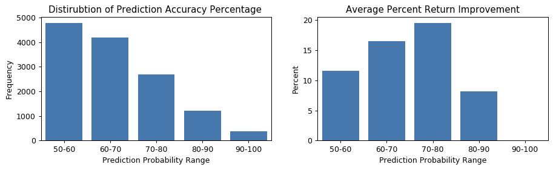


```python
print('Overall return without model:', ((accu_metrics['total_pymnt'].sum()/accu_metrics['loan_amnt'].sum()) - 1) * 100)

total_cost = accu_metrics.loc[accu_metrics['Prediction'] == 'Fully Paid']['loan_amnt'].sum()
total_return = accu_metrics.loc[accu_metrics['Prediction'] == 'Fully Paid']['total_pymnt'].sum()
print('Overall return with model:', ((total_return/total_cost) - 1) * 100)

orig_roi = accu_metrics['total_pymnt'].sum() - accu_metrics['loan_amnt'].sum()
new_roi = total_return - total_cost
pcnt_chng = ((new_roi - orig_roi) / abs(orig_roi)) * 100
print('Percent improvement:', pcnt_chng)
```

    Overall return without model: -20.615711683298986
    Overall return with model: -7.897430408063977
    Percent improvement: 84.04148464777614
    


```python

```
